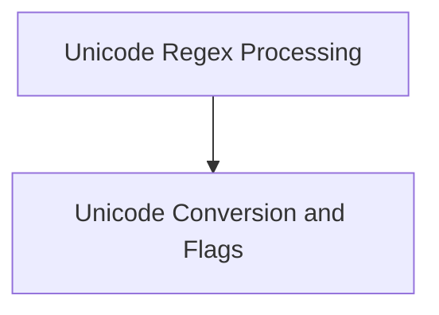

# Llama C++ Unicode Module

The `llama_cpp_unicode` module provides core functionalities for handling Unicode character processing within the Llama C++ project. This includes robust text splitting based on regular expressions that are aware of Unicode categories, as well as utilities for converting between UTF-8 and other character representations, and for extracting character properties.

## Architecture

This module is composed of two main sub-modules:

*   **[Unicode Regex Processing](unicode_regex_processing.md)**: Handles advanced text splitting with Unicode-aware regular expressions.
*   **[Unicode Conversion and Flags](unicode_conversion_and_flags.md)**: Provides utilities for character encoding conversion and property extraction.

<!-- DIAGRAM_JSON
{
    "direction": "TD",
    "nodes": [
        {"id": "unicode_regex_processing", "label": "Unicode Regex Processing", "type": "module", "link": "unicode_regex_processing.md"},
        {"id": "unicode_conversion_and_flags", "label": "Unicode Conversion and Flags", "type": "module", "link": "unicode_conversion_and_flags.md"}
    ],
    "edges": [
        {"source": "unicode_regex_processing", "target": "unicode_conversion_and_flags"}
    ],
    "groups": []
}
-->

## Sub-module Functionality

### Unicode Regex Processing
This sub-module, documented in [unicode_regex_processing.md](unicode_regex_processing.md), is responsible for the intricate task of splitting strings based on regular expressions. It is designed to work effectively with Unicode text by providing mechanisms to handle Unicode categories, collapsing them into single-byte representations when necessary for `std::regex` compatibility. It also incorporates custom efficient regex implementations and gracefully falls back to `std::wregex` for scenarios not requiring collapsed text.

### Unicode Conversion and Flags
Detailed in [unicode_conversion_and_flags.md](unicode_conversion_and_flags.md), this sub-module offers essential utilities for managing Unicode character data. It includes functions to convert UTF-8 encoded strings to their corresponding `unicode_cpt_flags` for detailed property inspection, such as identifying if a character is a letter, number, or punctuation. Additionally, it provides a utility for converting single UTF-8 characters to their byte representation, facilitating interoperability within the system.