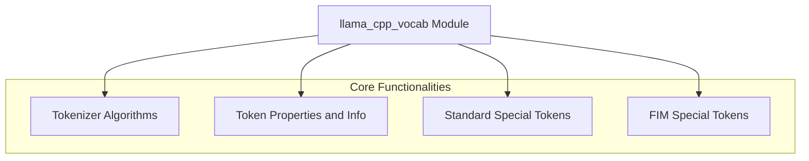

The `llama_cpp_vocab` module is central to handling the vocabulary and tokenization processes within the `llama.cpp` project. It provides implementations for various tokenization algorithms (Unigram, Byte Pair Encoding, and RWKV), manages special tokens (such as Beginning-of-Sentence, End-of-Sentence, and Fill-in-the-Middle tokens), and offers utilities to query token properties and information like vocabulary size, token scores, and attributes. This module is essential for converting raw text into a format suitable for Large Language Models and interpreting their outputs.

### Architecture Overview

The `llama_cpp_vocab` module is structured around several key sub-modules, each responsible for a distinct aspect of vocabulary management and tokenization.

### Core Components Documentation

The `llama_cpp_vocab` module exposes the following key components:

*   **Tokenization Algorithms:**
    *   `llama.llama.cpp.src.llama-vocab.llm_tokenizer_ugm`: Implements the Unigram Language Model (UGM) tokenization algorithm.
    *   `llama.llama.cpp.src.llama-vocab.llm_tokenizer_bpe`: Implements the Byte Pair Encoding (BPE) tokenization algorithm.
    *   `llama.llama.cpp.src.llama-vocab.llm_tokenizer_rwkv`: Provides the RWKV tokenization algorithm.
    *   [Tokenizer Algorithms](tokenizer_algorithms.md): Overview of the various tokenization methods.

*   **Token Properties and Information:**
    *   `llama.llama.cpp.src.llama-vocab.llama_n_vocab`: Retrieves the total number of tokens in the vocabulary.
    *   `llama.llama.cpp.src.llama-vocab.llama_token_get_score`: Retrieves the score associated with a specific token.
    *   `llama.llama.cpp.src.llama-vocab.llama_token_get_attr`: Retrieves the attributes of a given token.
    *   `llama.llama.cpp.src.llama-vocab.llama_token_is_eog`: Checks if a token signifies the end-of-generation.
    *   `llama.llama.cpp.src.llama-vocab.llama_token_is_control`: Checks if a token is a control token.
    *   [Token Properties and Info](token_properties_and_info.md): Detailed documentation on querying token attributes.

*   **Standard Special Tokens:**
    *   `llama.llama.cpp.src.llama-vocab.llama_token_bos`: Retrieves the Beginning-of-Sentence (BOS) token.
    *   `llama.llama.cpp.src.llama-vocab.llama_token_eos`: Retrieves the End-of-Sentence (EOS) token.
    *   `llama.llama.cpp.src.llama-vocab.llama_token_eot`: Retrieves the End-of-Text (EOT) token.
    *   `llama.llama.cpp.src.llama-vocab.llama_token_cls`: Retrieves the Classification (CLS) token.
    *   `llama.llama.cpp.src.llama-vocab.llama_token_sep`: Retrieves the Separator (SEP) token.
    *   `llama.llama.cpp.src.llama-vocab.llama_token_nl`: Retrieves the Newline (NL) token.
    *   `llama.llama.cpp.src.llama-vocab.llama_token_pad`: Retrieves the Padding (PAD) token.
    *   `llama.llama.cpp.src.llama-vocab.llama_add_bos_token`: Checks if BOS token should be added.
    *   `llama.llama.cpp.src.llama-vocab.llama_add_eos_token`: Checks if EOS token should be added.
    *   [Standard Special Tokens](standard_special_tokens.md): Comprehensive guide to standard special tokens.

*   **Fill-in-the-Middle (FIM) Special Tokens:**
    *   `llama.llama.cpp.src.llama-vocab.llama_token_fim_pre`: Retrieves the FIM prefix token.
    *   `llama.llama.cpp.src.llama-vocab.llama_token_fim_suf`: Retrieves the FIM suffix token.
    *   `llama.llama.cpp.src.llama-vocab.llama_token_fim_mid`: Retrieves the FIM middle token.
    *   `llama.llama.cpp.src.llama-vocab.llama_token_fim_pad`: Retrieves the FIM padding token.
    *   `llama.llama.cpp.src.llama-vocab.llama_token_fim_rep`: Retrieves the FIM replacement token.
    *   `llama.llama.cpp.src.llama-vocab.llama_token_fim_sep`: Retrieves the FIM separator token.
    *   [FIM Special Tokens](fim_special_tokens.md): Documentation specific to FIM-related tokens.