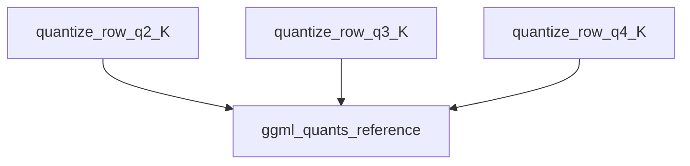

# Low-Bit Quantization Module

## Introduction

The `low_bit_quantization` module is a critical component within the `ggml_cpu_quants_generic` family, specifically focusing on kernel-specific row quantization for low-bit precisions. This module provides optimized functions for quantizing floating-point data into 2-bit, 3-bit, and 4-bit integer representations, which are crucial for reducing the memory footprint and accelerating inference of large language models on CPU architectures.

By converting higher-precision floating-point numbers into lower-precision integers, this module enables significant memory savings and computational speedups, albeit with a controlled trade-off in precision. It plays a vital role in making large models deployable and efficient on commodity hardware.

## Architecture and Component Relationships

This module encapsulates the core logic for low-bit quantization routines for "K" type blocks. It relies on reference implementations for the actual quantization algorithms, acting as an abstraction layer that can potentially be optimized for different CPU architectures (though the current implementations simply call reference functions).

<!-- DIAGRAM_JSON
{
    "direction": "TD",
    "nodes": [
        {"id": "quantize_row_q2_K", "label": "quantize_row_q2_K", "type": "component", "link": null},
        {"id": "quantize_row_q3_K", "label": "quantize_row_q3_K", "type": "component", "link": null},
        {"id": "quantize_row_q4_K", "label": "quantize_row_q4_K", "type": "component", "link": null},
        {"id": "ggml_quants_reference", "label": "ggml_quants_reference", "type": "external", "link": "ggml_quants_reference.md"}
    ],
    "edges": [
        {"source": "quantize_row_q2_K", "target": "ggml_quants_reference"},
        {"source": "quantize_row_q3_K", "target": "ggml_quants_reference"},
        {"source": "quantize_row_q4_K", "target": "ggml_quants_reference"}
    ],
    "groups": []
}
-->


## Core Functionality

The `low_bit_quantization` module provides the following core functions:

### `quantize_row_q2_K`

Quantizes a row of floating-point numbers into a 2-bit "K" quantized format. This function serves as a wrapper for the reference 2-bit quantization implementation.

```c
void quantize_row_q2_K(const float * GGML_RESTRICT x, void * GGML_RESTRICT vy, int64_t k) {
    quantize_row_q2_K_ref(x, vy, k);
}
```

### `quantize_row_q3_K`

Quantizes a row of floating-point numbers into a 3-bit "K" quantized format. This function delegates to the reference 3-bit quantization implementation.

```c
void quantize_row_q3_K(const float * GGML_RESTRICT x, void * GGML_RESTRICT vy, int64_t k) {
    quantize_row_q3_K_ref(x, vy, k);
}
```

### `quantize_row_q4_K`

Quantizes a row of floating-point numbers into a 4-bit "K" quantized format. This function includes an assertion for `k` divisibility by `QK_K` before calling the reference 4-bit quantization implementation.

```c
void quantize_row_q4_K(const float * GGML_RESTRICT x, void * GGML_RESTRICT vy, int64_t k) {
    assert(k % QK_K == 0);
    block_q4_K * GGML_RESTRICT y = vy;
    quantize_row_q4_K_ref(x, y, k);
}
```

## How it Fits into the Overall System

The `low_bit_quantization` module is a specialized part of the overall quantization strategy within the GGML library, particularly for CPU inference. It resides under `ggml_cpu_quants_generic.k_row_quantization`, indicating its role in providing generic CPU-based row quantization specifically for "K" type quantization blocks. These low-bit quantizations are critical for optimizing model performance and memory usage, enabling the deployment of large models on resource-constrained devices or for faster inference on standard CPUs. It works in conjunction with other quantization modules and the broader [ggml_core](ggml_core.md) library to achieve efficient neural network computations.