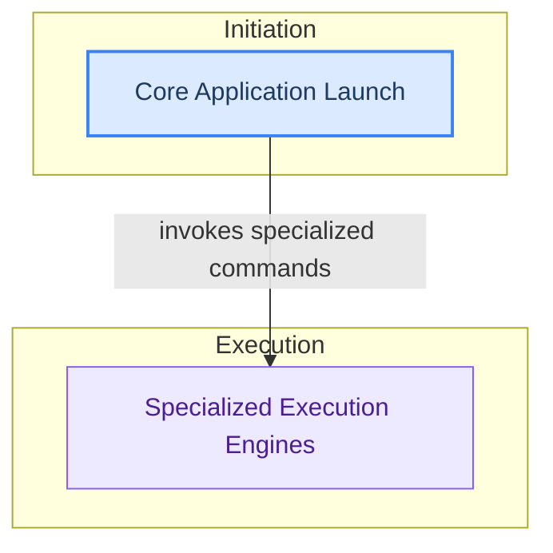

# Main Entry Points
This module defines the primary entry points for the application, encompassing the core application launcher, server execution, and various specialized command-line utilities for interactive models, image generation, and MLX code generation.

<!-- DIAGRAM_JSON
{
    "direction": "TD",
    "nodes": [
        {
            "id": "core_application_launch",
            "label": "Core Application Launch",
            "type": "module",
            "link": "core_application_launch.md"
        },
        {
            "id": "specialized_execution_engines",
            "label": "Specialized Execution Engines",
            "type": "module",
            "link": "specialized_execution_engines.md"
        }
    ],
    "edges": [
        {
            "source": "core_application_launch",
            "target": "specialized_execution_engines",
            "label": "invokes specialized commands"
        }
    ],
    "groups": [
        {
            "id": "initiation",
            "label": "Initiation",
            "role": "surface",
            "nodes": [
                "core_application_launch"
            ]
        },
        {
            "id": "execution",
            "label": "Execution",
            "role": "analytical",
            "nodes": [
                "specialized_execution_engines"
            ]
        }
    ]
}
-->
