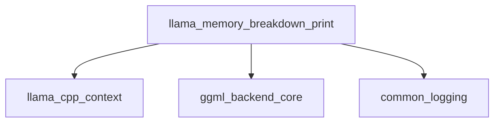

# Memory Analysis Module

The `memory_analysis` module is a crucial part of the `llama_cpp_context.monitoring_and_diagnostics` submodule, providing detailed insights into memory usage across various devices and buffer types within the `llama.cpp` framework. Its primary function is to generate a comprehensive breakdown of memory allocation, helping developers monitor, debug, and optimize memory consumption for `llama_context` instances.

### Core Functionality

The `memory_analysis` module is centered around the `llama_memory_breakdown_print` function. This function analyzes the memory footprint of a `llama_context` and outputs a human-readable table detailing how memory is utilized.

### Architecture and Component Relationships

<!-- DIAGRAM_JSON
{
    "direction": "TD",
    "nodes": [
        {"id": "llama_memory_breakdown_print", "label": "llama_memory_breakdown_print", "type": "component", "link": null},
        {"id": "llama_cpp_context", "label": "llama_cpp_context", "type": "external", "link": "llama_cpp_context.md"},
        {"id": "ggml_backend_core", "label": "ggml_backend_core", "type": "external", "link": "ggml_backend_core.md"},
        {"id": "common_logging", "label": "common_logging", "type": "external", "link": "common_logging.md"}
    ],
    "edges": [
        {"source": "llama_memory_breakdown_print", "target": "llama_cpp_context"},
        {"source": "llama_memory_breakdown_print", "target": "ggml_backend_core"},
        {"source": "llama_memory_breakdown_print", "target": "common_logging"}
    ],
    "groups": []
}
-->

### Component Description

*   **`llama_memory_breakdown_print`**: This is the core function of the module. It takes a `llama_context` as input and provides a detailed breakdown of memory usage. This includes:
    *   **Device-specific memory**: Total, free, and used memory for each detected GGML backend device (e.g., CPU, GPU).
    *   **Categorized memory usage**: Breakdown of used memory into `model`, `context`, and `compute` components.
    *   **Unaccounted memory**: Any memory on devices that isn't categorized, helping to identify potential leaks or unmanaged allocations.
    *   **Host memory**: Memory used by the host system for `model`, `context`, and `compute` data.
    *   **Other buffer types**: Memory used by other GGML buffer types not directly tied to a specific device or host.

### External Dependencies

*   **[llama_cpp_context](llama_cpp_context.md)**: The `llama_memory_breakdown_print` function relies on the `llama_context` structure to retrieve memory breakdown data and device information.
*   **[ggml_backend_core](ggml_backend_core.md)**: This module provides the necessary backend device and buffer type functionalities, such as `ggml_backend_buft_is_host`, `ggml_backend_buft_get_device`, `ggml_backend_dev_name`, `ggml_backend_dev_description`, `ggml_backend_dev_memory`, and `ggml_backend_buft_name`, which are critical for querying device information and memory statistics.
*   **[common_logging](common_logging.md)**: Used for logging the formatted memory breakdown output.

### How the Module Fits into the Overall System

The `memory_analysis` module is situated within the `llama_cpp_context.monitoring_and_diagnostics` submodule. Its role is essential for understanding the memory footprint of a running `llama.cpp` model. By providing a detailed breakdown of memory usage, it enables:

1.  **Performance Optimization**: Identifying memory bottlenecks and optimizing model or context parameters to reduce memory consumption.
2.  **Debugging**: Pinpointing memory leaks or unexpected memory allocations.
3.  **Resource Management**: Gaining a clear picture of how system memory and device-specific memory are being utilized, which is crucial for deploying `llama.cpp` applications efficiently, especially in environments with limited resources or multiple hardware accelerators.

It serves as a diagnostic tool that helps maintain the stability and efficiency of `llama.cpp` applications by offering transparency into their memory behavior.
