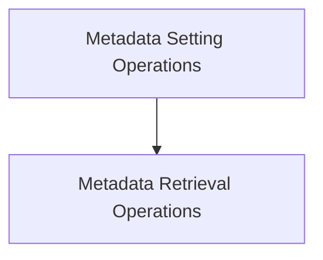

# Metadata Management Module

## Introduction
The `metadata_management` module is a core component within the `ggml_gguf_format` responsible for handling the storage, retrieval, and manipulation of metadata within GGUF (GGML Universal File Format) contexts. It provides a robust set of functions to manage key-value pairs, supporting a wide range of data types including integers, floats, booleans, strings, and arrays of these types. This module is essential for applications that need to store and access configuration, model parameters, or other relevant information embedded directly within GGUF files.

## Architecture Overview
The `metadata_management` module is logically divided into two primary sub-modules: `metadata_setting` and `metadata_retrieval`. These sub-modules encapsulate the functionalities for writing and reading metadata respectively, ensuring a clear separation of concerns.

<!-- DIAGRAM_JSON
{
    "direction": "TD",
    "nodes": [
        {"id": "metadata_setting", "label": "Metadata Setting Operations", "type": "module", "link": "metadata_setting.md"},
        {"id": "metadata_retrieval", "label": "Metadata Retrieval Operations", "type": "module", "link": "metadata_retrieval.md"}
    ],
    "edges": [
        {"source": "metadata_setting", "target": "metadata_retrieval"}
    ],
    "groups": []
}
-->

## Sub-modules

### [Metadata Setting Operations](metadata_setting.md)
This sub-module focuses on the functions responsible for writing metadata into a GGUF context. It provides an interface to set various types of key-value pairs, including primitive types and arrays, ensuring metadata can be stored flexibly.

### [Metadata Retrieval Operations](metadata_retrieval.md)
This sub-module provides functionalities for reading metadata from a GGUF context. It includes functions to retrieve metadata values by their keys, supporting different data types, and also allows for querying the size and raw data of the metadata section.