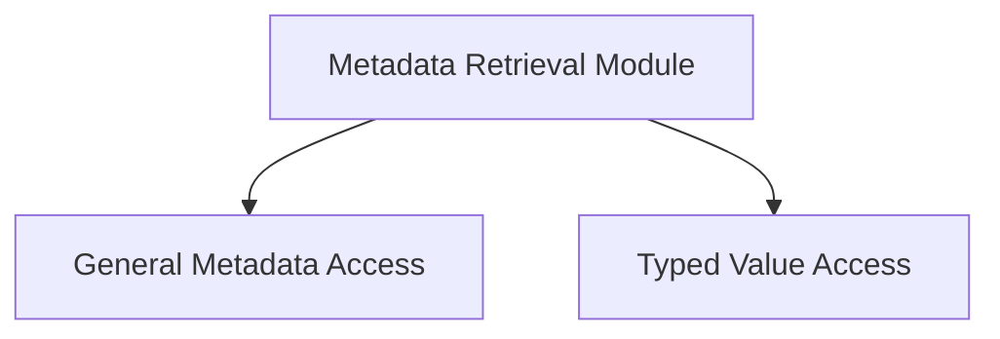

# Metadata Retrieval Module

The `metadata_retrieval` module is a crucial part of the GGUF (GGML Universal File Format) implementation, responsible for extracting and accessing metadata embedded within GGUF contexts. This module provides a set of functions to retrieve both general metadata information, such as size and raw data, and specific typed values associated with metadata keys.

## Architecture

The `metadata_retrieval` module is composed of two primary sub-modules:

- [General Metadata Access](general_metadata_access.md): Handles the retrieval of overall metadata structure and raw data.
- [Typed Value Access](typed_value_access.md): Provides functions to fetch metadata values cast to specific data types.

These sub-modules interact with the underlying `gguf_context` to expose metadata in a structured and type-safe manner.

<!-- DIAGRAM_JSON
{
    "direction": "TD",
    "nodes": [
        {"id": "general_metadata_access", "label": "General Metadata Access", "type": "module", "link": "general_metadata_access.md"},
        {"id": "typed_value_access", "label": "Typed Value Access", "type": "module", "link": "typed_value_access.md"}
    ],
    "edges": [
        {"source": "metadata_retrieval", "target": "general_metadata_access"},
        {"source": "metadata_retrieval", "target": "typed_value_access"}
    ],
    "groups": []
}
-->

## Sub-modules

### [General Metadata Access](general_metadata_access.md)
This sub-module focuses on providing access to the overall metadata embedded within a GGUF context. It includes functionalities to determine the total size of the metadata and to retrieve the raw byte data of the metadata block.

### [Typed Value Access](typed_value_access.md)
This sub-module offers a comprehensive set of functions for retrieving individual metadata values by their key identifier, with automatic type casting to various primitive data types such as `uint8_t`, `int8_t`, `uint16_t`, `int16_t`, `uint32_t`, `int32_t`, `float`, `uint64_t`, `int64_t`, `double`, and `bool`. This ensures type safety and simplifies the consumption of metadata values.