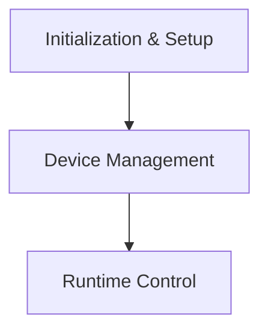

# GGML Metal Backend API (`metal_backend_api`)

## Introduction

The `metal_backend_api` module provides the core interface for integrating GGML with Apple's Metal framework. It enables the GGML library to leverage Metal-compatible GPUs for high-performance computation, facilitating efficient execution of machine learning models on Apple hardware. This module is responsible for device initialization, querying device capabilities, and managing Metal-specific operations within the GGML ecosystem.

## Architecture Overview

The `metal_backend_api` module serves as a critical bridge between the GGML core and the Metal hardware. It interacts with the broader `ggml_backend_metal` module to manage Metal devices and operations. The architecture is designed to abstract the complexities of Metal, providing a consistent API for GGML operations while maximizing performance on Metal-enabled devices.

<!-- DIAGRAM_JSON
{
    "direction": "TD",
    "nodes": [
        {"id": "initialization_and_setup", "label": "Initialization & Setup", "type": "module", "link": "initialization_and_setup.md"},
        {"id": "device_management", "label": "Device Management", "type": "module", "link": "device_management.md"},
        {"id": "runtime_control", "label": "Runtime Control", "type": "module", "link": "runtime_control.md"}
    ],
    "edges": [
        {"source": "initialization_and_setup", "target": "device_management"},
        {"source": "device_management", "target": "runtime_control"}
    ],
    "groups": []
}
-->

## Sub-modules

### [Initialization & Setup](initialization_and_setup.md)
This sub-module is responsible for the initial setup and configuration of the GGML Metal backend and individual Metal devices. It provides functions to allocate and initialize the necessary contexts for Metal operations.

### [Device Management](device_management.md)
This sub-module handles the querying of Metal device properties, capabilities, and buffer types. It allows the GGML backend to understand and utilize the specific characteristics of the underlying Metal hardware.

### [Runtime Control](runtime_control.md)
The Runtime Control sub-module offers functionalities for managing the execution flow and handling asynchronous operations. This includes setting abort callbacks for long-running computations and capturing compute operations for debugging and analysis.