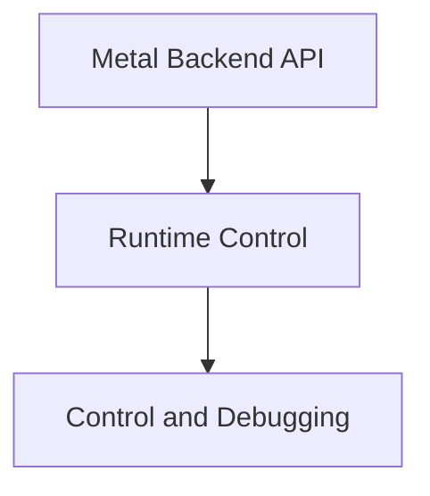

# metal_backend_control

The `metal_backend_control` module provides essential functionalities for managing and debugging operations within the GGML Metal backend. It allows for setting custom abort callbacks to handle unexpected events and offers a mechanism to capture the next compute command for detailed profiling and debugging.

## Architecture Overview

The `metal_backend_control` module is a small but critical part of the `ggml_backend_metal` framework, specifically nested within the `runtime_control` sub-module. It interacts directly with the core `ggml_metal` context to influence the behavior and observability of Metal backend operations.

<!-- DIAGRAM_JSON
{
    "direction": "TD",
    "nodes": [
        {"id": "metal_backend_api", "label": "Metal Backend API", "type": "module", "link": "metal_backend_api.md"},
        {"id": "runtime_control", "label": "Runtime Control", "type": "module", "link": "runtime_control.md"},
        {"id": "control_and_debugging", "label": "Control and Debugging", "type": "module", "link": "control_and_debugging.md"}
    ],
    "edges": [
        {"source": "metal_backend_api", "target": "runtime_control"},
        {"source": "runtime_control", "target": "control_and_debugging"}
    ],
    "groups": []
}
-->

## Sub-modules

- **[Control and Debugging](control_and_debugging.md)**: This sub-module contains functions to set abort callbacks and capture compute operations for debugging purposes within the Metal backend.
