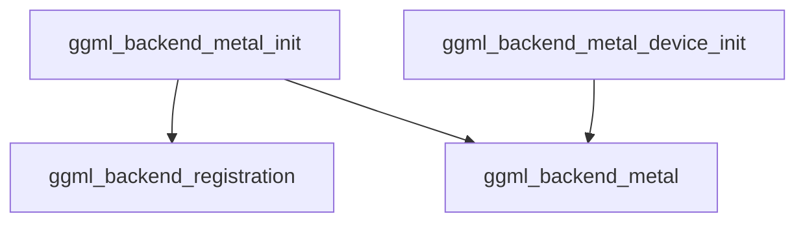

# metal_backend_initialization Module Documentation

## Introduction

The `metal_backend_initialization` module is a crucial component within the GGML Metal backend, responsible for the fundamental setup and initialization of the Metal accelerated computing environment. It provides the core functions necessary to instantiate a GGML Metal backend, enabling the library to leverage Apple's Metal API for high-performance operations.

## Architecture and Component Relationships

This module primarily exposes two functions, `ggml_backend_metal_init` and `ggml_backend_metal_device_init`, both of which serve to create and configure a `ggml_backend_t` instance for Metal. These functions interact with other key modules to achieve their purpose:

*   **ggml_backend_registration**: Used by `ggml_backend_metal_init` to retrieve a registered Metal device, which is essential for identifying and interacting with available Metal-compatible hardware.
*   **ggml_backend_metal**: This module contains lower-level Metal context initialization functions, such as `ggml_metal_init`, which are called by both initialization functions in this module to establish the actual Metal context.

The initialization process involves obtaining a Metal device context, creating a Metal context (`ggml_metal_t`), allocating the `ggml_backend_t` structure, and populating it with the necessary Metal-specific interfaces and contexts.

## How it Fits into the Overall System

The `metal_backend_initialization` module is a leaf module within the `ggml_backend_metal` module's `backend_initialization` sub-module. It acts as the concrete implementation layer for setting up the Metal backend. Any part of the GGML system that requires Metal acceleration will ultimately depend on the proper initialization provided by this module. It ensures that the GGML framework can correctly interface with the underlying Metal hardware and drivers, allowing for efficient execution of computational graphs on Apple GPUs.

<!-- DIAGRAM_JSON
{
    "direction": "TD",
    "nodes": [
        {"id": "init_func", "label": "ggml_backend_metal_init", "type": "component", "link": null},
        {"id": "device_init_func", "label": "ggml_backend_metal_device_init", "type": "component", "link": null},
        {"id": "backend_registration", "label": "ggml_backend_registration", "type": "external", "link": "ggml_backend_registration.md"},
        {"id": "metal_backend", "label": "ggml_backend_metal", "type": "external", "link": "ggml_backend_metal.md"}
    ],
    "edges": [
        {"source": "init_func", "target": "backend_registration"},
        {"source": "init_func", "target": "metal_backend"},
        {"source": "device_init_func", "target": "metal_backend"}
    ],
    "groups": []
}
-->
