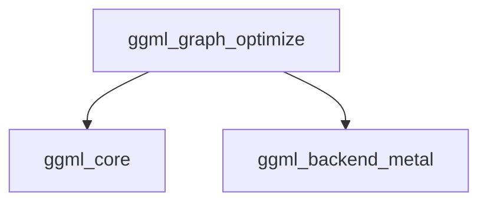

# metal_common_utilities Module Documentation

## Introduction

The `metal_common_utilities` module provides essential graph optimization utilities specifically designed for the GGML Metal backend. Its primary function is to enhance the performance of computational graphs by intelligently fusing and reordering operations, thereby improving concurrency and overall efficiency on Apple's Metal GPU framework.

## Architecture and Core Functionality

This module serves as a utility layer within the `ggml_backend_metal` ecosystem. It focuses on optimizing the execution flow of `ggml_cgraph` structures by applying sophisticated graph transformations before actual computation. The core component, `ggml_graph_optimize`, implements these optimizations.

<!-- DIAGRAM_JSON
{
    "direction": "TD",
    "nodes": [
        {"id": "ggml_graph_optimize", "label": "ggml_graph_optimize", "type": "component", "link": null},
        {"id": "ggml_core", "label": "ggml_core", "type": "external", "link": "ggml_core.md"},
        {"id": "ggml_backend_metal", "label": "ggml_backend_metal", "type": "external", "link": "ggml_backend_metal.md"}
    ],
    "edges": [
        {"source": "ggml_graph_optimize", "target": "ggml_core"},
        {"source": "ggml_graph_optimize", "target": "ggml_backend_metal"}
    ],
    "groups": []
}
-->

### `ggml_graph_optimize`

`ggml_graph_optimize` is the central function responsible for optimizing a given computation graph (`ggml_cgraph`). It performs two main types of optimizations:

1.  **Node Fusion:** It identifies sequences of operations (such as `ADD`, `NORM`, `RMS_NORM`, `MUL`) that can be safely combined into a single logical operation. This reduces the overhead associated with dispatching multiple individual kernels, leading to more efficient execution.
2.  **Node Reordering:** After identifying fusable nodes, the function reorders the nodes within the graph. This reordering is performed by an internal helper function, `ggml_metal_graph_optimize_reorder`, with the goal of maximizing concurrency and improving cache utilization on the Metal backend. The fused nodes are temporarily grouped and then "unfused" back into the optimized order.

#### Dependencies and Relationships

*   **[ggml_core](ggml_core.md)**: The `ggml_graph_optimize` function operates on `ggml_cgraph` structures, which are fundamental components defined within the `ggml_core` module. It relies on the basic graph representation and node types provided by `ggml_core`.
*   **[ggml_backend_metal](ggml_backend_metal.md)**: This module is a direct child of `ggml_backend_metal`, indicating its role as a specialized utility for Metal-specific graph optimizations. The optimizations implemented here are tailored to leverage the capabilities of the Metal framework.

## Integration with the Overall System

The `metal_common_utilities` module is an integral part of the GGML's Metal backend. When a computation graph is prepared for execution on a Metal-enabled device, the `ggml_graph_optimize` function is invoked to transform the graph into an optimized form. This optimization step is crucial for achieving high performance, particularly with complex neural network models, by ensuring that operations are grouped efficiently and executed concurrently on the GPU. It acts as an intermediary step between graph construction (from `ggml_core`) and graph execution (managed by `ggml_backend_metal`).