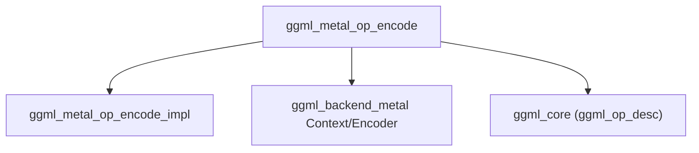

# `metal_operations` Module Documentation

## Introduction
The `metal_operations` module, a sub-module of `ggml_backend_metal`, is responsible for encoding individual computational graph operations, or fused groups of operations, for execution on Apple's Metal GPU API. It manages debug group capture for performance analysis and includes crucial error checking to ensure the correctness of fused operations.

## Architecture and Component Relationships

The `metal_operations` module contains the core logic for translating GGML operations into an executable format for the Metal backend. Its primary component, `ggml_metal_op_encode`, orchestrates this process, interfacing with other parts of the `ggml_backend_metal` module and the broader GGML ecosystem.

<!-- DIAGRAM_JSON
{
    "direction": "TD",
    "nodes": [
        {"id": "ggml_metal_op_encode", "label": "ggml_metal_op_encode", "type": "component", "link": null},
        {"id": "ggml_metal_op_encode_impl", "label": "ggml_metal_op_encode_impl", "type": "component", "link": null},
        {"id": "ggml_backend_metal", "label": "ggml_backend_metal Context/Encoder", "type": "external", "link": "ggml_backend_metal.md"},
        {"id": "ggml_core", "label": "ggml_core (ggml_op_desc)", "type": "external", "link": "ggml_core.md"}
    ],
    "edges": [
        {"source": "ggml_metal_op_encode", "target": "ggml_metal_op_encode_impl"},
        {"source": "ggml_metal_op_encode", "target": "ggml_backend_metal"},
        {"source": "ggml_metal_op_encode", "target": "ggml_core"}
    ],
    "groups": []
}
-->



### Core Components

#### `ggml_metal_op_encode`

```cpp
int ggml_metal_op_encode(ggml_metal_op_t ctx, int idx) {
    if (ctx->use_capture) {
        ggml_metal_encoder_debug_group_push(ctx->enc, ggml_op_desc(ctx->node(idx)));
    }

    int res = ggml_metal_op_encode_impl(ctx, idx);
    if (idx + res > ctx->n_nodes()) {
        GGML_ABORT("fusion error: nodes spanning multiple encoders have been fused. this indicates a bug in the fusion logic %s",
                "https://github.com/ggml-org/llama.cpp/pull/14849");
    }

    if (ctx->use_capture) {
        ggml_metal_encoder_debug_group_pop(ctx->enc);
    }

    return res;
}
```

This function is the entry point for encoding a Metal operation. It performs the following key tasks:
*   **Debug Group Management**: If `ctx->use_capture` is enabled, it pushes a debug group onto the Metal encoder (`ctx->enc`) using the operation description obtained via `ggml_op_desc` and `ctx->node(idx)`. This helps in profiling and debugging Metal workloads.
*   **Operation Encoding**: It delegates the actual encoding logic to `ggml_metal_op_encode_impl`, which is expected to perform the low-level Metal API calls to encode the operation `idx` within the given context `ctx`.
*   **Fusion Error Detection**: It includes a critical check to detect "fusion errors," where fused operations might incorrectly span multiple encoders. Such an error indicates a bug in the graph fusion logic and leads to an abort.
*   **Debug Group Pop**: If a debug group was pushed, it ensures that the group is popped before returning.

`ggml_metal_op_encode_impl` is an internal function responsible for the specific Metal API calls to encode an operation. Its implementation is internal to the `ggml_backend_metal` module.

## Integration with the Overall System

The `metal_operations` module is an integral part of the [ggml_backend_metal](ggml_backend_metal.md) module, providing the fundamental mechanism for translating GGML computational graph nodes into executable Metal commands. It works in conjunction with the Metal context management and resource allocation handled by `ggml_backend_metal` to facilitate high-performance execution of GGML models on Apple hardware.

It relies on:
*   **`ggml_backend_metal`**: For the Metal encoder (`ctx->enc`), context management (`ggml_metal_op_t`), and debug group functionalities (`ggml_metal_encoder_debug_group_push`, `ggml_metal_encoder_debug_group_pop`).
*   **`ggml_core`**: To retrieve operation descriptions (`ggml_op_desc`) for debug group labeling.

This module ensures that operations are correctly encoded, debuggable, and that graph fusion integrity is maintained within the Metal backend.
