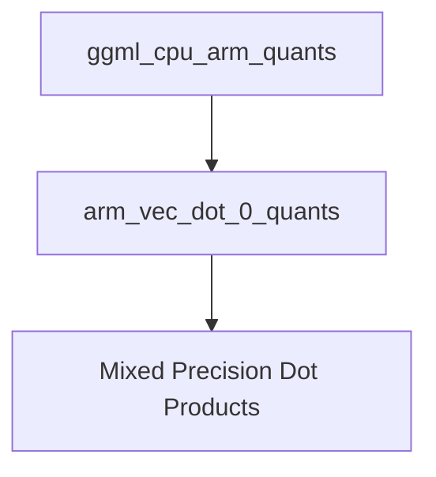

# Mixed Precision Dot Products Module

## Introduction and Purpose

The `mixed_precision_dot_products` module provides highly optimized vector dot product implementations specifically designed for ARM architectures, handling various mixed-precision quantization schemes. This module is a critical component within the `ggml` library's CPU backend, enabling efficient inference with quantized models by accelerating the core mathematical operations.

Its primary purpose is to perform efficient dot product calculations between vectors quantized using different formats, such as MXFP4, IQ4_NL, and Q8_0, which are common in machine learning models for reducing memory footprint and computational cost.

## Architecture Overview

This module is situated within the `ggml_cpu_arm_quants` hierarchy, specifically under `arm_vec_dot_0_quants`. It directly implements specialized vector dot product functions that leverage ARM NEON intrinsics for performance acceleration.

It interacts with other quantization modules by processing their specific quantized data formats (`block_mxfp4`, `block_iq4_nl`, `block_q8_0`) to produce a single floating-point sum. The module does not manage quantization itself but consumes pre-quantized data.

<!-- DIAGRAM_JSON
{
    "direction": "TD",
    "nodes": [
        {"id": "ggml_cpu_arm_quants", "label": "ggml_cpu_arm_quants", "type": "module", "link": "ggml_cpu_arm_quants.md"},
        {"id": "arm_vec_dot_0_quants", "label": "arm_vec_dot_0_quants", "type": "module", "link": "arm_vec_dot_0_quants.md"},
        {"id": "mixed_precision_dot_products", "label": "Mixed Precision Dot Products", "type": "module", "link": "mixed_precision_dot_products.md"}
    ],
    "edges": [
        {"source": "ggml_cpu_arm_quants", "target": "arm_vec_dot_0_quants"},
        {"source": "arm_vec_dot_0_quants", "target": "mixed_precision_dot_products"}
    ],
    "groups": []
}
-->

## Core Functionality

The `mixed_precision_dot_products` module contains highly optimized functions for performing dot products on mixed-precision quantized data.

### `ggml_vec_dot_mxfp4_q8_0`

This function computes the dot product of a vector quantized in `MXFP4` format (`vx`) and another vector quantized in `Q8_0` format (`vy`). It is specifically optimized for ARM NEON-enabled processors.

-   **Input**:
    -   `n`: Total number of elements for the dot product.
    -   `s`: Pointer to the output float where the sum will be stored.
    -   `vx`: Pointer to the input vector `x` (type `block_mxfp4`).
    -   `vy`: Pointer to the input vector `y` (type `block_q8_0`).
-   **Output**: The computed dot product sum stored in `*s`.
-   **Optimization**: Leverages ARM NEON intrinsics (`vld1q_u8`, `ggml_vqtbl1q_s8`, `ggml_vdotq_s32`, `vaddvq_s32`) for significant performance gains over a scalar implementation.
-   **Data Types**: Operates on `block_mxfp4` (mixed-precision float 4-bit) and `block_q8_0` (quantized 8-bit) data structures.

### `ggml_vec_dot_iq4_nl_q8_0`

Similar to `ggml_vec_dot_mxfp4_q8_0`, this function computes the dot product but for a vector quantized in `IQ4_NL` format (`vx`) and a vector quantized in `Q8_0` format (`vy`). It also utilizes ARM NEON for performance.

-   **Input**:
    -   `n`: Total number of elements for the dot product.
    -   `s`: Pointer to the output float where the sum will be stored.
    -   `vx`: Pointer to the input vector `x` (type `block_iq4_nl`).
    -   `vy`: Pointer to the input vector `y` (type `block_q8_0`).
-   **Output**: The computed dot product sum stored in `*s`.
-   **Optimization**: Employs ARM NEON intrinsics, similar to `ggml_vec_dot_mxfp4_q8_0`, to ensure fast execution.
-   **Data Types**: Works with `block_iq4_nl` (integer quantized 4-bit, non-linear) and `block_q8_0` (quantized 8-bit) data structures.

This module is crucial for the efficient execution of quantized neural networks on ARM-based CPUs within the `ggml` ecosystem, providing the low-level numerical primitives for mixed-precision inference.
