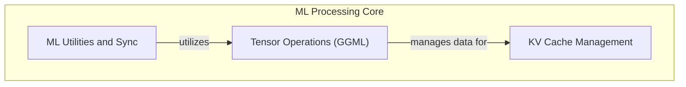

# ML Backends and Operations
This module encapsulates core machine learning backend functionalities, including efficient Key-Value (KV) cache management, fundamental tensor operations for the GGML framework, and essential ML utilities with internal synchronization mechanisms.

<!-- DIAGRAM_JSON
{
    "direction": "TD",
    "nodes": [
        {"id": "kv_cache_management", "label": "KV Cache Management", "type": "module", "link": "kv_cache_management.md"},
        {"id": "tensor_operations", "label": "Tensor Operations (GGML)", "type": "module", "link": "tensor_operations.md"},
        {"id": "ml_utilities_and_sync", "label": "ML Utilities and Sync", "type": "module", "link": "ml_utilities_and_sync.md"}
    ],
    "edges": [
        {"source": "tensor_operations", "target": "kv_cache_management", "label": "manages data for"},
        {"source": "ml_utilities_and_sync", "target": "tensor_operations", "label": "utilizes"}
    ],
    "groups": [
        {"id": "ml_processing", "label": "ML Processing Core", "role": "analytical", "nodes": ["kv_cache_management", "tensor_operations", "ml_utilities_and_sync"]}
    ]
}
-->
