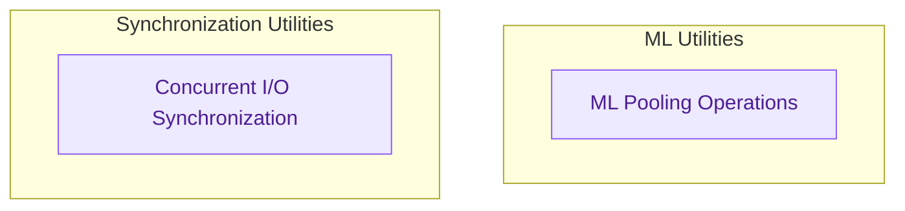

# ML Utilities and Synchronization
This module provides fundamental machine learning utilities, such as neural network pooling operations, alongside essential internal synchronization mechanisms for efficient concurrent data processing.

<!-- DIAGRAM_JSON
{
    "direction": "TD",
    "nodes": [
        {"id": "ml_pooling", "label": "ML Pooling Operations", "type": "component", "link": null},
        {"id": "sync_pipeline", "label": "Concurrent I/O Synchronization", "type": "component", "link": null}
    ],
    "edges": [],
    "groups": [
        {"id": "ml_utils_group", "label": "ML Utilities", "role": "analytical", "nodes": ["ml_pooling"]},
        {"id": "sync_utils_group", "label": "Synchronization Utilities", "role": "analytical", "nodes": ["sync_pipeline"]}
    ]
}
-->
