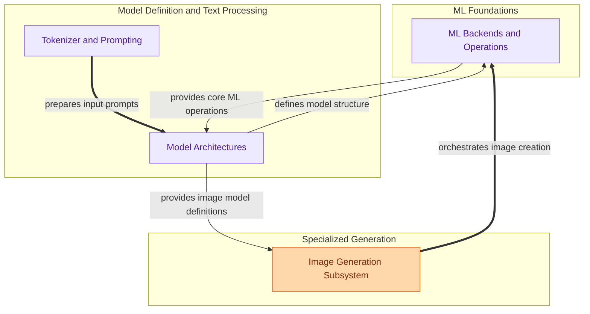

The `model_architecture_and_ml_ops` module is the core engine for handling the entire lifecycle of AI models within the application. It empowers users to seamlessly create, convert, store, and serve models, providing the foundational machine learning components, model architectures, and operational aspects necessary for robust AI functionality. This includes low-level ML operations, specific neural network implementations, text processing (tokenization and prompting), and a dedicated subsystem for image generation.

### How the Module's Components Work Together

The `model_architecture_and_ml_ops` module orchestrates several key functionalities:

### Core Components Documentation

*   **ML Backends and Operations**: This module encapsulates core machine learning backend functionalities, including efficient Key-Value (KV) cache management, fundamental tensor operations for the GGML framework, and essential ML utilities with internal synchronization mechanisms.
    *   [View ML Backends and Operations Documentation](ml_backends_and_ops.md)

*   **Model Architectures**: This module defines and implements various neural network model architectures, including sequential models like Mamba2 and Gated DeltaNet, as well as advanced Mixture-of-Experts (MoE) designs, enabling their forward pass operations.
    *   [View Model Architectures Documentation](model_architectures.md)

*   **Tokenizer and Prompting**: This module is responsible for tokenizing input text, managing prompt templates, and generating structured prompts for models, including handling dynamic content, chat history, and model-specific rendering rules. It also includes components for parsing model files and benchmarking tokenizer performance.
    *   [View Tokenizer and Prompting Documentation](tokenizer_and_prompting.md)

*   **Image Generation Subsystem**: This module manages the core logic for generating images using various models like Flux2 and Z-Image, handling model capability validation and exposing image generation functionality through an API.
    *   [View Image Generation Subsystem Documentation](image_generation_subsystem.md)