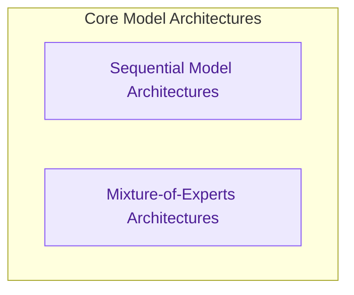

# Model Architectures
This module defines and implements various neural network model architectures, including sequential models like Mamba2 and Gated DeltaNet, as well as advanced Mixture-of-Experts (MoE) designs, enabling their forward pass operations.

<!-- DIAGRAM_JSON
{
    "direction": "TD",
    "nodes": [
        {
            "id": "sequential_architectures",
            "label": "Sequential Model Architectures",
            "type": "module",
            "link": "sequential_architectures.md"
        },
        {
            "id": "moe_architectures",
            "label": "Mixture-of-Experts Architectures",
            "type": "module",
            "link": "moe_architectures.md"
        }
    ],
    "edges": [],
    "groups": [
        {
            "id": "architectures_core",
            "label": "Core Model Architectures",
            "role": "analytical",
            "nodes": [
                "sequential_architectures",
                "moe_architectures"
            ]
        }
    ]
}
-->
