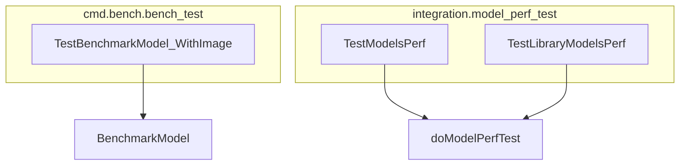

# model_benchmarking
This module provides functions for benchmarking and performance testing of models, including specific tests for models handling image inputs and general performance evaluations for various model types.

<!-- DIAGRAM_JSON
{
  "nodes": [
    {
      "id": "A",
      "label": "TestBenchmarkModel_WithImage"
    },
    {
      "id": "B",
      "label": "TestModelsPerf"
    },
    {
      "id": "C",
      "label": "TestLibraryModelsPerf"
    },
    {
      "id": "D",
      "label": "BenchmarkModel"
    },
    {
      "id": "E",
      "label": "doModelPerfTest"
    }
  ],
  "edges": [
    {
      "source": "A",
      "target": "D"
    },
    {
      "source": "B",
      "target": "E"
    },
    {
      "source": "C",
      "target": "E"
    }
  ],
  "groups": [
    {
      "id": "group_integration_model_perf_test",
      "label": "integration.model_perf_test",
      "members": [
        "B",
        "C"
      ]
    },
    {
      "id": "group_cmd_bench_bench_test",
      "label": "cmd.bench.bench_test",
      "members": [
        "A"
      ]
    }
  ]
}
-->
