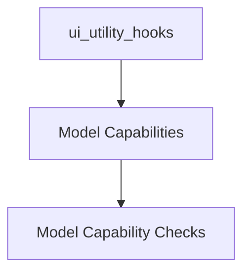

# model_capabilities Module Documentation

## Introduction and Purpose

The `model_capabilities` module provides a set of React hooks designed to determine the specific capabilities of a given model. This module is essential for dynamically adjusting the user interface and application logic based on whether a model supports features such as vision processing or external tool integration. It acts as a bridge between the model's advertised capabilities and the UI components that rely on these features.

## Architecture Overview

The `model_capabilities` module is a core part of the `ui_utility_hooks` within the `app_ui_hooks` ecosystem. It encapsulates the logic for querying model capabilities, typically by interacting with an underlying API or data source that provides model metadata. Its primary function is to abstract away the details of capability retrieval, offering simple, reusable hooks to other UI components. This ensures a clean separation of concerns and promotes modularity within the application's front-end logic.

<!-- DIAGRAM_JSON
{
    "direction": "TD",
    "nodes": [
        {"id": "ui_utility_hooks_ext", "label": "ui_utility_hooks", "type": "external"},
        {"id": "model_capabilities_mod", "label": "Model Capabilities", "type": "module", "link": "model_capabilities.md"},
        {"id": "capability_checks", "label": "Model Capability Checks", "type": "module", "link": "capability_checks.md"}
    ],
    "edges": [
        {"source": "ui_utility_hooks_ext", "target": "model_capabilities_mod"},
        {"source": "model_capabilities_mod", "target": "capability_checks"}
    ],
    "groups": []
}
-->

## Sub-modules

### Model Capability Checks
The `capability_checks` sub-module contains specific React hooks, such as `useHasVisionCapability` and `useHasToolsCapability`, which provide an easy way to verify if a loaded model supports visual processing or the use of external tools. These hooks typically leverage a shared underlying mechanism to fetch model capabilities and expose a boolean result, simplifying conditional rendering and feature activation in the UI. For more details, refer to the [Model Capability Checks](capability_checks.md) documentation.
