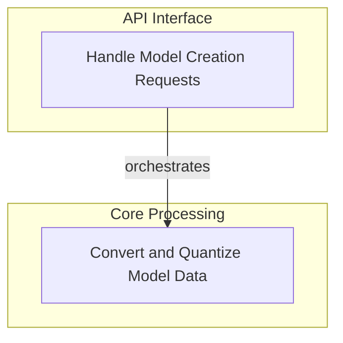

# Model Creation and Conversion
This module provides the core functionalities for creating, converting, and optimizing language models. It handles API requests for model creation, manages file format conversions, applies quantization, and processes model configurations and metadata.

<!-- DIAGRAM_JSON
{
    "direction": "TD",
    "nodes": [
        {"id": "model_creation_api", "label": "Handle Model Creation Requests", "type": "module", "link": "model_creation_api.md"},
        {"id": "model_data_processing", "label": "Convert and Quantize Model Data", "type": "module", "link": "model_data_processing.md"}
    ],
    "edges": [
        {"source": "model_creation_api", "target": "model_data_processing", "label": "orchestrates"}
    ],
    "groups": [
        {"id": "api_interface", "label": "API Interface", "role": "surface", "nodes": ["model_creation_api"]},
        {"id": "core_processing", "label": "Core Processing", "role": "analytical", "nodes": ["model_data_processing"]}
    ]
}
-->

