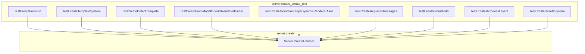

# model_creation_api
This module provides the API endpoint for creating new models, handling various configurations like files, templates, system prompts, and messages. It includes comprehensive test cases to ensure correct model creation, inheritance, and configuration updates.

<!-- DIAGRAM_JSON
{
  "nodes": [
    {"id": "server.create.Server.CreateHandler", "label": "Server.CreateHandler", "type": "Go Function"},
    {"id": "server.routes_create_test.TestCreateFromBin", "label": "TestCreateFromBin", "type": "Go Test Function"},
    {"id": "server.routes_create_test.TestCreateTemplateSystem", "label": "TestCreateTemplateSystem", "type": "Go Test Function"},
    {"id": "server.routes_create_test.TestCreateDetectTemplate", "label": "TestCreateDetectTemplate", "type": "Go Test Function"},
    {"id": "server.routes_create_test.TestCreateFromModelInheritsRendererParser", "label": "TestCreateFromModelInheritsRendererParser", "type": "Go Test Function"},
    {"id": "server.routes_create_test.TestCreateGemma4KeepsDynamicRendererAlias", "label": "TestCreateGemma4KeepsDynamicRendererAlias", "type": "Go Test Function"},
    {"id": "server.routes_create_test.TestCreateReplacesMessages", "label": "TestCreateReplacesMessages", "type": "Go Test Function"},
    {"id": "server.routes_create_test.TestCreateFromModel", "label": "TestCreateFromModel", "type": "Go Test Function"},
    {"id": "server.routes_create_test.TestCreateRemovesLayers", "label": "TestCreateRemovesLayers", "type": "Go Test Function"},
    {"id": "server.routes_create_test.TestCreateUnsetsSystem", "label": "TestCreateUnsetsSystem", "type": "Go Test Function"}
  ],
  "edges": [
    {"source": "server.routes_create_test.TestCreateFromBin", "target": "server.create.Server.CreateHandler", "label": "calls"},
    {"source": "server.routes_create_test.TestCreateTemplateSystem", "target": "server.create.Server.CreateHandler", "label": "calls"},
    {"source": "server.routes_create_test.TestCreateDetectTemplate", "target": "server.create.Server.CreateHandler", "label": "calls"},
    {"source": "server.routes_create_test.TestCreateFromModelInheritsRendererParser", "target": "server.create.Server.CreateHandler", "label": "calls"},
    {"source": "server.routes_create_test.TestCreateGemma4KeepsDynamicRendererAlias", "target": "server.create.Server.CreateHandler", "label": "calls"},
    {"source": "server.routes_create_test.TestCreateReplacesMessages", "target": "server.create.Server.CreateHandler", "label": "calls"},
    {"source": "server.routes_create_test.TestCreateFromModel", "target": "server.create.Server.CreateHandler", "label": "calls"},
    {"source": "server.routes_create_test.TestCreateRemovesLayers", "target": "server.create.Server.CreateHandler", "label": "calls"},
    {"source": "server.routes_create_test.TestCreateUnsetsSystem", "target": "server.create.Server.CreateHandler", "label": "calls"}
  ],
  "groups": [
    {"id": "server.create", "label": "server.create", "nodes": ["server.create.Server.CreateHandler"]},
    {"id": "server.routes_create_test", "label": "server.routes_create_test", "nodes": [
      "server.routes_create_test.TestCreateFromBin",
      "server.routes_create_test.TestCreateTemplateSystem",
      "server.routes_create_test.TestCreateDetectTemplate",
      "server.routes_create_test.TestCreateFromModelInheritsRendererParser",
      "server.routes_create_test.TestCreateGemma4KeepsDynamicRendererAlias",
      "server.routes_create_test.TestCreateReplacesMessages",
      "server.routes_create_test.TestCreateFromModel",
      "server.routes_create_test.TestCreateRemovesLayers",
      "server.routes_create_test.TestCreateUnsetsSystem"
    ]}
  ]
}
-->
