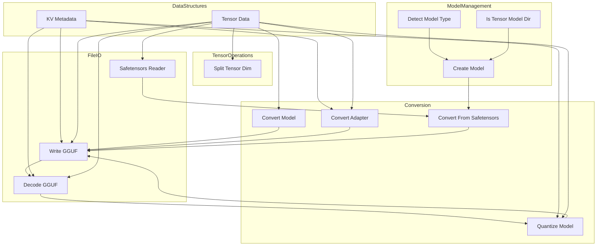

# model_data_processing
This module handles the conversion, processing, and management of model data, including GGUF and Safetensors formats, tensor operations, and quantization.

<!-- DIAGRAM_JSON
{
  "nodes": [
    {"id": "ConvertModel", "label": "Convert Model", "group": "Conversion"},
    {"id": "ConvertAdapter", "label": "Convert Adapter", "group": "Conversion"},
    {"id": "SafetensorsReader", "label": "Safetensors Reader", "group": "FileIO"},
    {"id": "SplitTensorDim", "label": "Split Tensor Dim", "group": "TensorOps"},
    {"id": "WriteGGUF", "label": "Write GGUF", "group": "FileIO"},
    {"id": "DecodeGGUF", "label": "Decode GGUF", "group": "FileIO"},
    {"id": "ConvertFromSafetensors", "label": "Convert From Safetensors", "group": "Conversion"},
    {"id": "QuantizeModel", "label": "Quantize Model", "group": "Conversion"},
    {"id": "DetectModelType", "label": "Detect Model Type", "group": "ModelManagement"},
    {"id": "CreateModel", "label": "Create Model", "group": "ModelManagement"},
    {"id": "IsTensorModelDir", "label": "Is Tensor Model Dir", "group": "ModelManagement"},
    {"id": "KVMetadata", "label": "KV Metadata", "group": "DataStructures"},
    {"id": "TensorData", "label": "Tensor Data", "group": "DataStructures"}
  ],
  "edges": [
    {"source": "ConvertModel", "target": "WriteGGUF"},
    {"source": "ConvertAdapter", "target": "WriteGGUF"},
    {"source": "SafetensorsReader", "target": "ConvertFromSafetensors"},
    {"source": "ConvertFromSafetensors", "target": "WriteGGUF"},
    {"source": "DecodeGGUF", "target": "QuantizeModel"},
    {"source": "QuantizeModel", "target": "WriteGGUF"},
    {"source": "DetectModelType", "target": "CreateModel"},
    {"source": "IsTensorModelDir", "target": "CreateModel"},
    {"source": "CreateModel", "target": "ConvertFromSafetensors"},
    {"source": "WriteGGUF", "target": "DecodeGGUF"},
    {"source": "KVMetadata", "target": "WriteGGUF"},
    {"source": "KVMetadata", "target": "DecodeGGUF"},
    {"source": "KVMetadata", "target": "ConvertAdapter"},
    {"source": "KVMetadata", "target": "QuantizeModel"},
    {"source": "TensorData", "target": "WriteGGUF"},
    {"source": "TensorData", "target": "DecodeGGUF"},
    {"source": "TensorData", "target": "SplitTensorDim"},
    {"source": "TensorData", "target": "QuantizeModel"},
    {"source": "TensorData", "target": "ConvertModel"},
    {"source": "TensorData", "target": "ConvertAdapter"},
    {"source": "TensorData", "target": "SafetensorsReader"}
  ],
  "groups": [
    {"id": "Conversion", "label": "Conversion"},
    {"id": "FileIO", "label": "File I/O"},
    {"id": "TensorOps", "label": "Tensor Operations"},
    {"id": "ModelManagement", "label": "Model Management"},
    {"id": "DataStructures", "label": "Data Structures"}
  ]
}
-->
