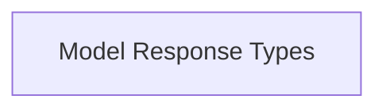

# `model_data_structures` Module Documentation

## Introduction

The `model_data_structures` module defines the core data structures used for handling model-related responses within the user interface. It ensures consistent data representation for lists of available models and their upstream status, facilitating reliable communication between the UI and backend services.

## Architecture

This module is primarily composed of data structures that define the contracts for UI components interacting with model information.

<!-- DIAGRAM_JSON
{
    "direction": "TD",
    "nodes": [
        {"id": "model_response_types", "label": "Model Response Types", "type": "module", "link": "model_response_types.md"}
    ],
    "edges": [],
    "groups": []
}
-->

## Sub-modules

### `model_response_types`

This sub-module encapsulates the data structures for responses concerning model availability and their status from upstream sources. It includes definitions for receiving lists of models and checking if model data is stale or has encountered errors.

For more detailed information, refer to the [Model Response Types documentation](model_response_types.md).