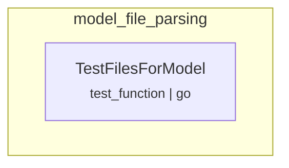

# model_file_parsing
This module contains test cases for parsing and identifying model files within a directory. It covers various model file formats like Safetensors and PyTorch, including handling of associated configuration and tokenizer files.

<!-- DIAGRAM_JSON
{
  "nodes": [
    {
      "id": "parser.parser_test.TestFilesForModel",
      "label": "TestFilesForModel",
      "type": "test_function",
      "language": "go"
    }
  ],
  "edges": [],
  "groups": [
    {
      "id": "model_file_parsing",
      "label": "model_file_parsing",
      "contains": [
        "parser.parser_test.TestFilesForModel"
      ]
    }
  ]
}
-->
