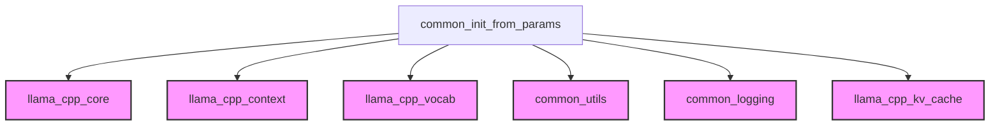

# model_initialization

The following documentation provides a comprehensive overview of the `model_initialization` module, detailing its purpose, architecture, and integration within the larger system.

---

# model_initialization

The `model_initialization` module is a critical component responsible for setting up and preparing the `llama` model and its execution context for various tasks. It handles the loading of the model, configuration of the context, application of adapters (such as control vectors and LoRA), and an optional warmup phase to ensure optimal performance.

## Purpose and Core Functionality

The primary purpose of the `model_initialization` module is to encapsulate the complex logic required to bring a `llama` model into an operational state. Its core functionality revolves around the `common_init_from_params` component, which orchestrates the entire initialization process. This includes:

*   **Model and Context Loading**: It loads the `llama_model` and creates the `llama_context` based on the provided parameters.
*   **KV Cache Shifting**: Checks for and enables/disables KV cache shifting support as per configuration.
*   **Control Vector Application**: Applies control vectors to modify model behavior if specified in the initialization parameters.
*   **Reranking Compatibility**: Verifies if the model's vocabulary and chat template support reranking operations.
*   **LoRA Adapter Management**: Loads and applies LoRA adapters, allowing for fine-tuning or specialized model behavior without modifying the base model.
*   **Model Warmup**: Performs an optional initial run with dummy data to warm up the model and optimize its internal state, improving subsequent inference performance.

By centralizing these initialization steps, the module ensures consistency and simplifies the process for other parts of the system that interact with the `llama` model.

## Architecture and Component Relationships

The `model_initialization` module, primarily through its `common_init_from_params` component, interacts with several other modules to achieve its functionality. The architecture diagram below illustrates these relationships.

<!-- DIAGRAM_JSON
{
    "direction": "TD",
    "nodes": [
        {"id": "common_init_from_params", "label": "common_init_from_params", "type": "component", "link": null},
        {"id": "llama_cpp_core", "label": "llama_cpp_core", "type": "external", "link": "llama_cpp_core.md"},
        {"id": "llama_cpp_context", "label": "llama_cpp_context", "type": "external", "link": "llama_cpp_context.md"},
        {"id": "llama_cpp_vocab", "label": "llama_cpp_vocab", "type": "external", "link": "llama_cpp_vocab.md"},
        {"id": "common_utils", "label": "common_utils", "type": "external", "link": "common_utils.md"},
        {"id": "common_logging", "label": "common_logging", "type": "external", "link": "common_logging.md"},
        {"id": "llama_cpp_kv_cache", "label": "llama_cpp_kv_cache", "type": "external", "link": "llama_cpp_kv_cache.md"}
    ],
    "edges": [
        {"source": "common_init_from_params", "target": "llama_cpp_core"},
        {"source": "common_init_from_params", "target": "llama_cpp_context"},
        {"source": "common_init_from_params", "target": "llama_cpp_vocab"},
        {"source": "common_init_from_params", "target": "common_utils"},
        {"source": "common_init_from_params", "target": "common_logging"},
        {"source": "common_init_from_params", "target": "llama_cpp_kv_cache"}
    ],
    "groups": []
}
-->

### Component Breakdown

*   **`common_init_from_params`**: This is the central function of the `model_initialization` module. It orchestrates the entire model and context setup.

### External Dependencies

*   **`llama_cpp_core`**: This module provides core `llama` model functionalities, including loading models, accessing model properties (like layer count, chat templates), encoding/decoding operations, and LoRA adapter initialization and metadata retrieval.
*   **`llama_cpp_context`**: Manages the `llama` context, including creating, accessing its memory, applying control vectors, managing pooling types, setting warmup states, and synchronizing operations.
*   **`llama_cpp_vocab`**: Provides access to the model's vocabulary, allowing the retrieval of special tokens like BOS (Beginning Of Sentence), EOS (End Of Sentence), and SEP (Separator).
*   **`common_utils`**: This module likely contains utility functions such as `common_control_vector_load` for loading control vectors and `common_set_adapter_lora` for applying LoRA adapters to the context.
*   **`common_logging`**: Utilized for logging error and warning messages during the initialization process (`LOG_ERR`, `LOG_WRN`).
*   **`llama_cpp_kv_cache`**: Provides functions related to the KV cache, specifically `llama_memory_can_shift`, which checks if KV cache shifting is supported.

## How the Module Fits into the Overall System

The `model_initialization` module acts as the entry point for preparing `llama` models for use throughout the system. Any part of the application that requires an active and configured `llama` model will depend on this module to handle the initial setup. This includes:

*   **Inference Engines**: Components responsible for generating text or processing prompts will call this module to get a ready-to-use `llama_context`.
*   **Adapter Management Systems**: Modules that provide dynamic model modifications (e.g., loading different LoRA adapters on the fly) will rely on the `model_initialization` module's capabilities to apply these changes.
*   **Benchmarking and Performance Testing**: Tools that evaluate model performance will use this module to ensure the model is initialized consistently, including the warmup phase.

By centralizing model initialization, the system ensures that models are always set up correctly and consistently, promoting modularity and reducing boilerplate code across different functional areas.