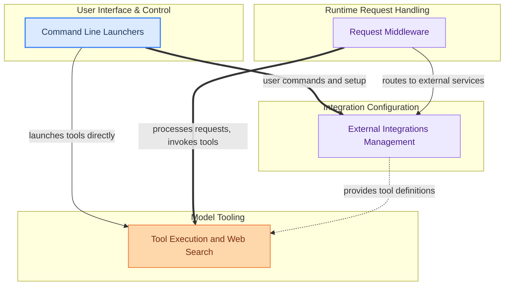

The `model_integrations_and_tools` module is the central hub for extending the application's capabilities through external services, specialized tools, and flexible request processing. It empowers users to seamlessly integrate with various external AI platforms and services (like VS Code, Hermes, OpenClaw, Droid, OpenCode, and Pi), enabling models to leverage external tools such as web search to augment their intelligence. Furthermore, it provides a robust middleware system to process and transform API requests and responses, ensuring compatibility across different model APIs (e.g., Anthropic, OpenAI). Users interact with this module primarily through command-line interfaces for managing and launching these integrations and models, including interactive configuration flows.

### Core Components Documentation

*   **Command Line Launchers**: Manages command-line interactions for running models, managing integrations, and configuring settings.
*   **External Integrations**: Handles connections and interactions with external services and platforms like VS Code, Hermes, and OpenClaw.
*   **Request Middleware**: Intercepts and transforms API requests and responses to support various models and API specifications (e.g., Anthropic, OpenAI).
*   **Tool Execution and Web Search**: Provides and manages tools for models, including web search capabilities and browser-like operations.