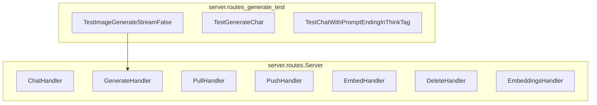

# model_interaction_endpoints
This module defines API endpoints for interacting with AI models, including chat, text generation, model management (pull, push, delete), and embeddings. It also includes tests for generation and chat functionalities.

<!-- DIAGRAM_JSON
{
  "nodes": [
    {"id": "ChatHandler", "label": "ChatHandler"},
    {"id": "GenerateHandler", "label": "GenerateHandler"},
    {"id": "PullHandler", "label": "PullHandler"},
    {"id": "PushHandler", "label": "PushHandler"},
    {"id": "EmbedHandler", "label": "EmbedHandler"},
    {"id": "DeleteHandler", "label": "DeleteHandler"},
    {"id": "EmbeddingsHandler", "label": "EmbeddingsHandler"},
    {"id": "TestImageGenerateStreamFalse", "label": "TestImageGenerateStreamFalse"},
    {"id": "TestGenerateChat", "label": "TestGenerateChat"},
    {"id": "TestChatWithPromptEndingInThinkTag", "label": "TestChatWithPromptEndingInThinkTag"}
  ],
  "edges": [
    {"source": "TestImageGenerateStreamFalse", "target": "GenerateHandler"}
  ],
  "groups": [
    {"id": "ServerRoutes", "label": "server.routes.Server", "nodes": ["ChatHandler", "GenerateHandler", "PullHandler", "PushHandler", "EmbedHandler", "DeleteHandler", "EmbeddingsHandler"]},
    {"id": "GenerateTests", "label": "server.routes_generate_test", "nodes": ["TestImageGenerateStreamFalse", "TestGenerateChat", "TestChatWithPromptEndingInThinkTag"]}
  ]
}
-->
