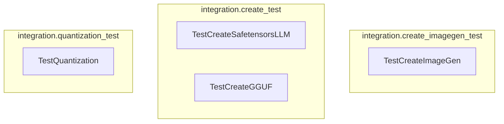

# model_lifecycle_tests
This module contains integration tests for various model lifecycle operations, including creating different model types (image generation, Safetensors LLM, GGUF) and testing model quantization.

<!-- DIAGRAM_JSON
{
  "nodes": [
    {"id": "TestCreateImageGen", "label": "TestCreateImageGen"},
    {"id": "TestCreateSafetensorsLLM", "label": "TestCreateSafetensorsLLM"},
    {"id": "TestCreateGGUF", "label": "TestCreateGGUF"},
    {"id": "TestQuantization", "label": "TestQuantization"}
  ],
  "edges": [],
  "groups": [
    {"id": "integration.create_imagegen_test", "label": "integration.create_imagegen_test", "nodes": ["TestCreateImageGen"]},
    {"id": "integration.create_test", "label": "integration.create_test", "nodes": ["TestCreateSafetensorsLLM", "TestCreateGGUF"]},
    {"id": "integration.quantization_test", "label": "integration.quantization_test", "nodes": ["TestQuantization"]}
  ]
}
-->
