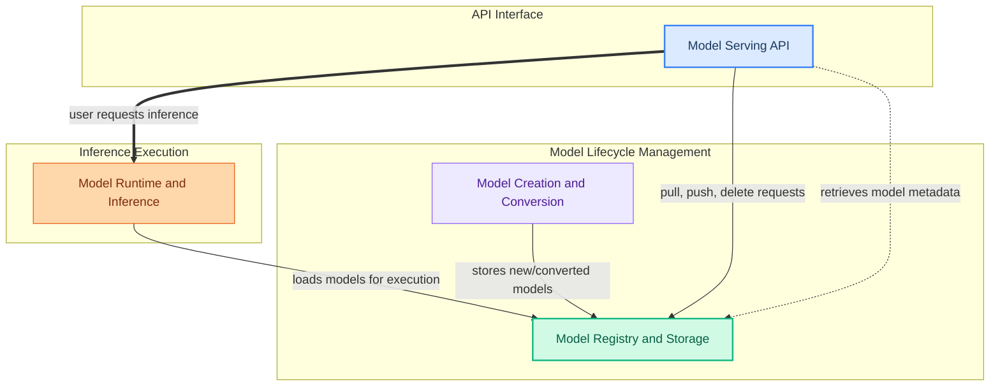

The `model_management_and_serving` module is the core engine for handling the entire lifecycle of AI models within the application. It empowers users to seamlessly create, convert, store, and serve models, making them accessible for various tasks like chat, generation, and embeddings. This module ensures that models are efficiently managed from their initial creation and registration to their high-performance deployment and inference.

### How it Works

The module is structured into several key components that work in concert to provide a robust model management and serving platform:

1.  **Model Serving API**: This component exposes the public API endpoints that users and client applications interact with. It handles requests for chat, text generation, embeddings, and model management operations like pulling, pushing, and deleting models. It acts as the primary entry point for all model-related interactions.

2.  **Model Creation and Conversion**: This module provides the tools and processes necessary to prepare models for use. It handles the creation of new models, conversion between different formats (e.g., Safetensors to GGUF), and quantization for optimization. Once processed, these models are stored for later use.

3.  **Model Registry and Storage**: This component is responsible for managing model artifacts, including local caching, pulling models from remote registries, and pushing models to them. It ensures that models are persistently stored and readily available for the inference engine.

4.  **Model Runtime and Inference**: This is the execution engine that loads, runs, and manages model inference. It includes specialized runners for different model types, a robust text generation pipeline, and an advanced Key-Value (KV) cache for efficient context management and state preservation during conversations.

Together, these components provide a comprehensive solution for managing and serving AI models, from initial preparation to high-performance, scalable inference.

### Core Components Documentation

*   **Model Registry and Storage**: Manages model artifacts, pulling, pushing, and local caching.
*   **Model Creation and Conversion**: Tools and processes for creating, converting, and quantizing models.
*   **Model Serving API**: Defines and handles the public API endpoints for interacting with models.
*   **Model Runtime and Inference**: Components responsible for loading, running, and managing model inference.