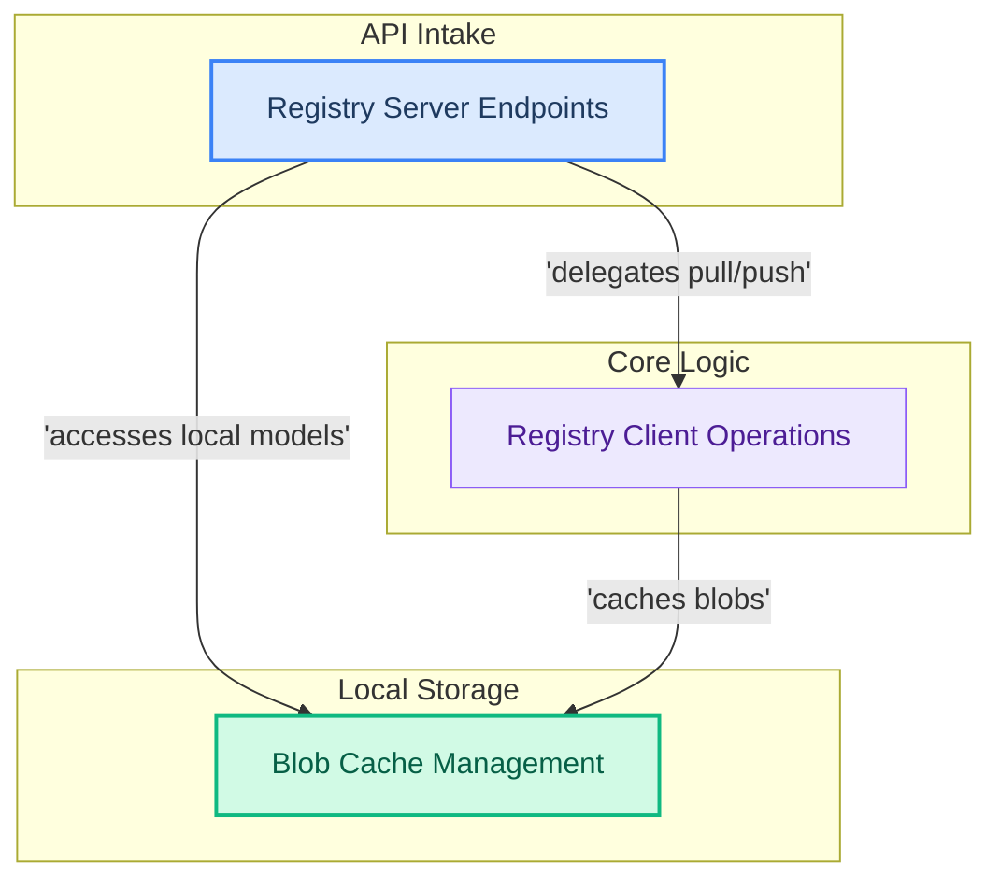

# Model Registry and Storage

This module manages the registration, storage, and retrieval of AI models. It includes client-side operations for interacting with model registries and server-side endpoints for serving and deleting models.

<!-- DIAGRAM_JSON
{
    "direction": "TD",
    "nodes": [
        {"id": "registry_server_endpoints", "label": "Registry Server Endpoints", "type": "module", "link": "registry_server_endpoints.md"},
        {"id": "registry_client_operations", "label": "Registry Client Operations", "type": "module", "link": "registry_client_operations.md"},
        {"id": "blob_cache_management", "label": "Blob Cache Management", "type": "module", "link": "blob_cache_management.md"}
    ],
    "edges": [
        {"source": "registry_server_endpoints", "target": "registry_client_operations", "label": "delegates pull/push"},
        {"source": "registry_server_endpoints", "target": "blob_cache_management", "label": "accesses local models"},
        {"source": "registry_client_operations", "target": "blob_cache_management", "label": "caches blobs"}
    ],
    "groups": [
        {"id": "intake", "label": "API Intake", "role": "surface", "nodes": ["registry_server_endpoints"]},
        {"id": "core_logic", "label": "Core Logic", "role": "analytical", "nodes": ["registry_client_operations"]},
        {"id": "storage", "label": "Local Storage", "role": "data", "nodes": ["blob_cache_management"]}
    ]
}
-->
