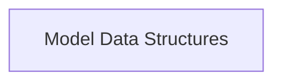

# Model Related Responses Module

This module (`model_related_responses`) is responsible for defining the data structures used to handle responses related to models within the UI application. It specifically provides classes for parsing and representing model lists and their upstream status.

## Architecture Overview

This module contains data structures for handling model-related responses.

<!-- DIAGRAM_JSON
{
    "direction": "TD",
    "nodes": [
        {"id": "model_data_structures", "label": "Model Data Structures", "type": "module", "link": "model_data_structures.md"}
    ],
    "edges": [],
    "groups": []
}
-->

## Sub-modules

### [Model Data Structures](model_data_structures.md)
This sub-module defines the data structures used for representing model responses and their upstream status within the UI. It includes classes like `ModelsResponse` for handling lists of models and `ModelUpstreamResponse` for indicating the status of an upstream model.