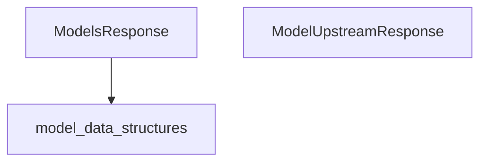

The `model_response_types` module defines essential data structures for handling responses related to models within the application's UI codegen framework. It provides clear and consistent interfaces for consuming model data and tracking the status of upstream model sources, facilitating robust data flow and error handling.

### Core Functionality

This module encapsulates two primary response types:

1.  **`ModelsResponse`**: Used for encapsulating a collection of `Model` objects. This is typically employed when the UI needs to display a list of available models, such as in a model selection interface.
2.  **`ModelUpstreamResponse`**: Provides status information about the freshness and potential errors from an upstream model source. This helps the UI understand if the displayed model data is current or if there was an issue retrieving it.

### Architecture and Component Relationships

The `model_response_types` module is a leaf module within the `app_ui_codegen_types` hierarchy, specifically nested under `model_data_structures`. It relies on the `Model` data structure, which is defined in its parent module, `model_data_structures`, for the `ModelsResponse` component.

<!-- DIAGRAM_JSON
{
    "direction": "TD",
    "nodes": [
        {"id": "models_response", "label": "ModelsResponse", "type": "component", "link": null},
        {"id": "model_upstream_response", "label": "ModelUpstreamResponse", "type": "component", "link": null},
        {"id": "model_data_structures", "label": "model_data_structures", "type": "external", "link": "model_data_structures.md"}
    ],
    "edges": [
        {"source": "models_response", "target": "model_data_structures"}
    ],
    "groups": []
}
-->

*   **`ModelsResponse`**: This component's primary role is to deserialize a list of model objects. It contains a `convertValues` utility method that aids in transforming raw data into structured `Model` instances.
*   **`ModelUpstreamResponse`**: This component is a lightweight data structure designed to convey the `stale` status and any `error` messages related to an upstream model data fetch.
*   **`model_data_structures`**: (External Dependency) This module is expected to define the `Model` class, which `ModelsResponse` utilizes to type its list of models.

### How the Module Fits into the Overall System

The `model_response_types` module is a crucial part of the UI's interaction with backend model services. It provides the concrete types that the UI expects when requesting and receiving lists of models or status updates for model data.

This module ensures:
*   **Type Safety**: By defining explicit response types, it helps in maintaining type consistency across the UI codebase.
*   **Clear Communication**: The `ModelUpstreamResponse` clearly communicates the state of model data, enabling the UI to provide appropriate feedback to the user (e.g., "data might be old," "failed to load models").
*   **Deserialization Logic**: The `convertValues` method within `ModelsResponse` offers a standardized way to deserialize complex JSON responses into TypeScript objects, reducing boilerplate and potential errors elsewhere in the UI code generation.

It integrates with other parts of the `app_ui_codegen_types` by providing the fundamental response structures, which are then used by higher-level components that interact with the application's API client. For further details on the `Model` data structure, refer to the [model_data_structures.md](model_data_structures.md) documentation.
