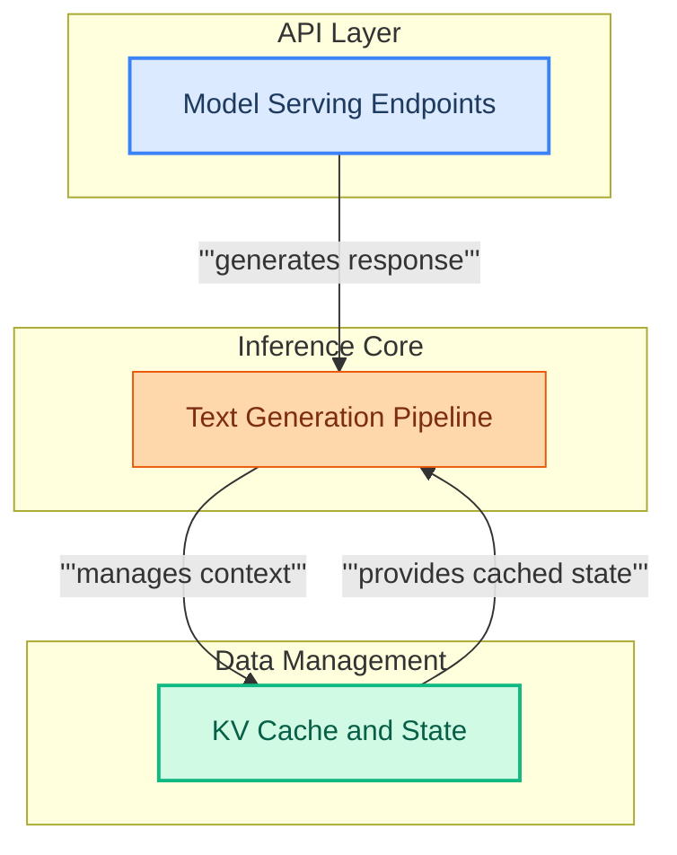

# Model Runtime and Inference
This module handles the runtime execution and inference for language models, providing server endpoints for loading, generating, and embedding. It features a robust text generation pipeline and an advanced Key-Value cache for efficient management of model states and conversation history.

<!-- DIAGRAM_JSON
{
    "direction": "TD",
    "nodes": [
        {"id": "inference_server_backends", "label": "Model Serving Endpoints", "type": "module", "link": "inference_server_backends.md"},
        {"id": "text_generation_pipeline", "label": "Text Generation Pipeline", "type": "module", "link": "text_generation_pipeline.md"},
        {"id": "kv_cache_and_state", "label": "KV Cache and State", "type": "module", "link": "kv_cache_and_state.md"}
    ],
    "edges": [
        {"source": "inference_server_backends", "target": "text_generation_pipeline", "label": "generates response"},
        {"source": "text_generation_pipeline", "target": "kv_cache_and_state", "label": "manages context"},
        {"source": "kv_cache_and_state", "target": "text_generation_pipeline", "label": "provides cached state"}
    ],
    "groups": [
        {"id": "api_layer", "label": "API Layer", "role": "surface", "nodes": ["inference_server_backends"]},
        {"id": "inference_core", "label": "Inference Core", "role": "generative", "nodes": ["text_generation_pipeline"]},
        {"id": "data_management", "label": "Data Management", "role": "data", "nodes": ["kv_cache_and_state"]}
    ]
}
-->
