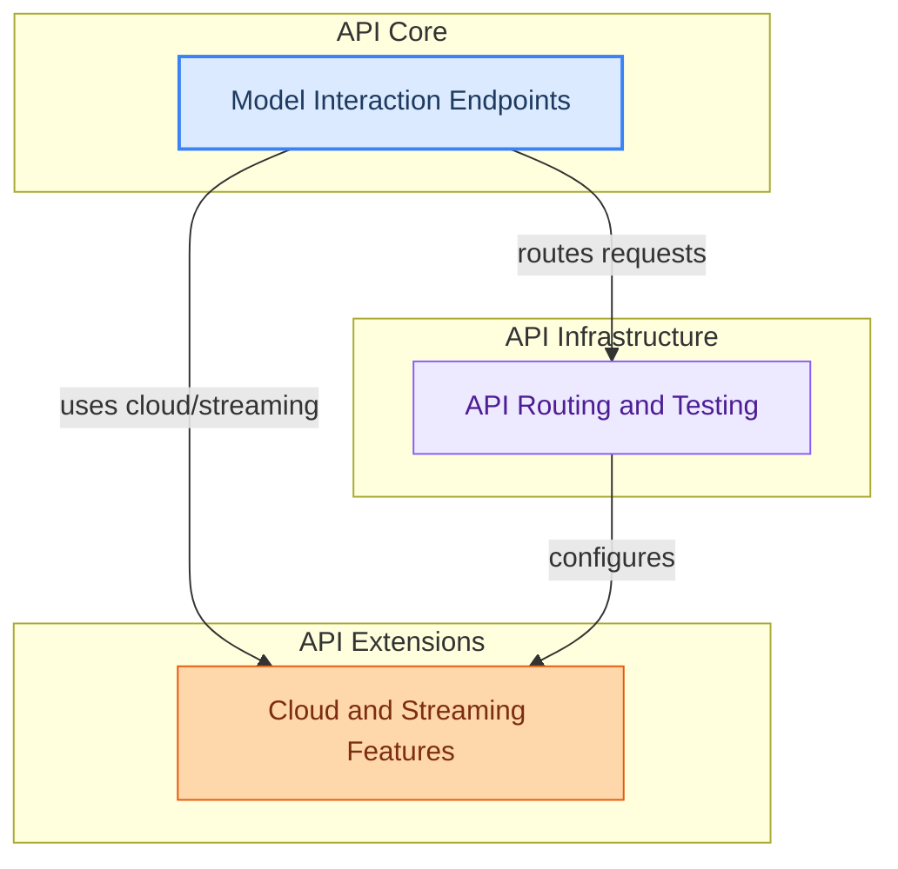

# Model Serving API

This module provides the core API for serving models, including endpoints for chat, text generation, embeddings, model management (pull, push, delete), and listing models. It also handles cloud model integration, experimental web features, and robust streaming capabilities.

<!-- DIAGRAM_JSON
{
    "direction": "TB",
    "nodes": [
        {
            "id": "model_interaction_endpoints",
            "label": "Model Interaction Endpoints",
            "type": "module",
            "link": "model_interaction_endpoints.md"
        },
        {
            "id": "api_routing_and_testing",
            "label": "API Routing and Testing",
            "type": "module",
            "link": "api_routing_and_testing.md"
        },
        {
            "id": "cloud_and_streaming_features",
            "label": "Cloud and Streaming Features",
            "type": "module",
            "link": "cloud_and_streaming_features.md"
        }
    ],
    "edges": [
        {
            "source": "model_interaction_endpoints",
            "target": "api_routing_and_testing",
            "label": "routes requests"
        },
        {
            "source": "model_interaction_endpoints",
            "target": "cloud_and_streaming_features",
            "label": "uses cloud/streaming"
        },
        {
            "source": "api_routing_and_testing",
            "target": "cloud_and_streaming_features",
            "label": "configures"
        }
    ],
    "groups": [
        {
            "id": "api_core",
            "label": "API Core",
            "role": "surface",
            "nodes": [
                "model_interaction_endpoints"
            ]
        },
        {
            "id": "api_infra",
            "label": "API Infrastructure",
            "role": "analytical",
            "nodes": [
                "api_routing_and_testing"
            ]
        },
        {
            "id": "api_extensions",
            "label": "API Extensions",
            "role": "generative",
            "nodes": [
                "cloud_and_streaming_features"
            ]
        }
    ]
}
-->

