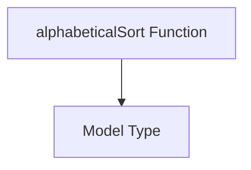

# Module: `model_sorting`

## Introduction
The `model_sorting` module, located within `app_ui_utils`, provides essential utilities for sorting model data within the application's user interface. Its primary function is to ensure consistent alphabetical ordering of model objects, enhancing user experience when displaying or selecting models.

## Module Purpose and Core Functionality
This module is dedicated to providing a standardized method for sorting `Model` objects. The core functionality revolves around the `alphabeticalSort` function, which enables case-insensitive alphabetical sorting based on a model's `model` property. This is particularly useful for dropdowns, lists, or any UI component that presents a collection of models to the user.

### Core Component: `alphabeticalSort`

The `alphabeticalSort` function facilitates the comparison of two `Model` objects for sorting purposes.

```typescript
function alphabeticalSort(a: Model, b: Model): number {
  return a.model.toLowerCase().localeCompare(b.model.toLowerCase());
}
```

-   **Parameters:**
    -   `a: Model`: The first model object to compare.
    -   `b: Model`: The second model object to compare.
-   **Returns:**
    -   `number`: A negative number if `a` comes before `b`, a positive number if `a` comes after `b`, or zero if they are equivalent in sorting order. The comparison is case-insensitive.

## Architecture and Component Relationships

The `model_sorting` module is a leaf module primarily comprising the `alphabeticalSort` function. It relies on the definition of the `Model` type.

<!-- DIAGRAM_JSON
{
    "direction": "TD",
    "nodes": [
        {"id": "alphabetical_sort", "label": "alphabeticalSort Function", "type": "component", "link": null},
        {"id": "model_type", "label": "Model Type", "type": "external", "link": "app_ui_types.md"}
    ],
    "edges": [
        {"source": "alphabetical_sort", "target": "model_type"}
    ],
    "groups": []
}
-->


## How the Module Fits into the Overall System
The `model_sorting` module is a utility within the `app_ui_utils` module, which serves the broader `app_ui` (application user interface) component. It acts as a foundational sorting mechanism, ensuring that model data presented throughout the UI is consistently and predictably ordered. This contributes to a clean and intuitive user interface for model selection and display. It indirectly supports modules like `app_ui_components` which might render lists of models.
