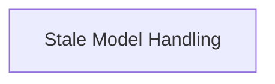

# Model Status Management

## Introduction

The `model_status_management` module is responsible for handling the status and display of models within the application's UI, specifically focusing on identifying and managing "stale" or outdated models. It provides mechanisms to determine if a model is stale and allows users to dismiss these notifications.

## Architecture

The `model_status_management` module integrates with the application's UI hooks to provide real-time status updates and user interaction for model management. It relies on query client data for managing dismissed model states and interacts with model refetching mechanisms.

<!-- DIAGRAM_JSON
{
    "direction": "TD",
    "nodes": [
        {"id": "stale_model_handling", "label": "Stale Model Handling", "type": "module", "link": "stale_model_handling.md"}
    ],
    "edges": [],
    "groups": []
}
-->

## Sub-modules

### Stale Model Handling

The `stale_model_handling` sub-module ([`stale_model_handling.md`](stale_model_handling.md)) encapsulates the logic for determining if a model is stale and provides functionality for dismissing stale model notifications. It leverages the `useQueryClient` for state management and interacts with model refetching to ensure the UI reflects the most current model statuses.