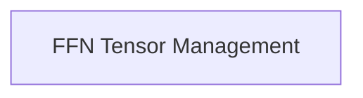

# Model Tensor Utilities

The `model_tensor_utils` module is responsible for providing utilities related to model tensor management, specifically focusing on Feed-Forward Network (FFN) tensor buffer overrides and associated regex patterns for efficient CPU operations within the `llama.cpp` project. It ensures that FFN expressions are correctly identified and handled for performance optimization.

## Architecture Overview

This module contains a single sub-module that encapsulates the core logic for FFN tensor management.

<!-- DIAGRAM_JSON
{
    "direction": "TD",
    "nodes": [
        {"id": "ffn_tensor_management", "label": "FFN Tensor Management", "type": "module", "link": "ffn_tensor_management.md"}
    ],
    "edges": [],
    "groups": []
}
-->

## Sub-modules

### [FFN Tensor Management](ffn_tensor_management.md)
This sub-module handles the creation of regex patterns for identifying FFN blocks and provides functions for overriding tensor buffer types specifically for FFN expressions to optimize CPU usage.