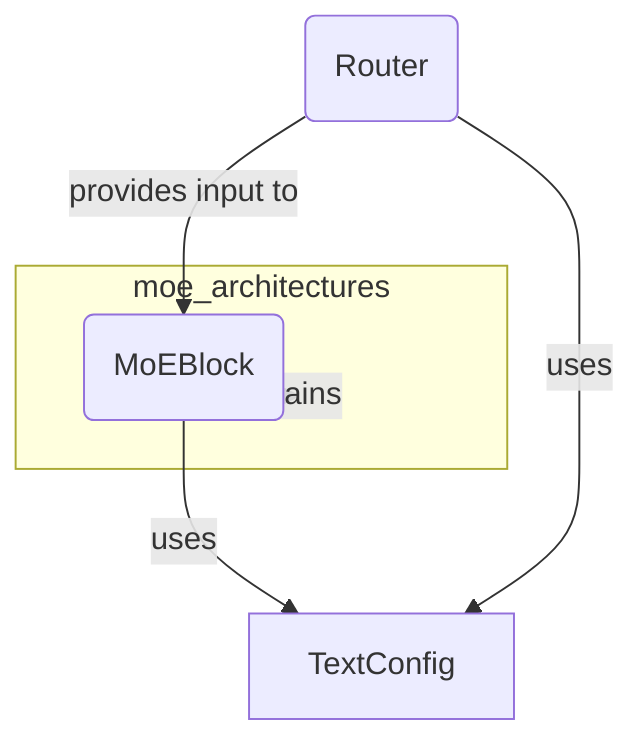

# moe_architectures
This module provides the `MoEBlock` component, a core building block for Mixture-of-Experts architectures, handling expert routing and computation based on configuration.

<!-- DIAGRAM_JSON
{
  "nodes": [
    {
      "id": "moe_architectures",
      "label": "moe_architectures",
      "type": "module"
    },
    {
      "id": "MoEBlock",
      "label": "MoEBlock",
      "type": "component"
    },
    {
      "id": "Router",
      "label": "Router",
      "type": "component"
    },
    {
      "id": "TextConfig",
      "label": "TextConfig",
      "type": "data"
    }
  ],
  "edges": [
    {
      "from": "moe_architectures",
      "to": "MoEBlock",
      "label": "contains",
      "type": "composition"
    },
    {
      "from": "MoEBlock",
      "to": "TextConfig",
      "label": "uses",
      "type": "dependency"
    },
    {
      "from": "Router",
      "to": "TextConfig",
      "label": "uses",
      "type": "dependency"
    },
    {
      "from": "Router",
      "to": "MoEBlock",
      "label": "provides input to",
      "type": "flow"
    }
  ],
  "groups": [
    {
      "id": "moe_architectures_group",
      "label": "moe_architectures",
      "nodes": ["MoEBlock"]
    }
  ]
}
-->
