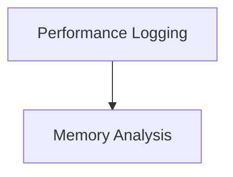

# Monitoring and Diagnostics Module

## Introduction

The `monitoring_and_diagnostics` module provides essential tools for understanding the performance and resource utilization of the Llama context. It offers functionalities to log performance metrics and provide detailed memory breakdown, crucial for optimizing and debugging the model's operation.

## Architecture Overview

The module is composed of two primary sub-modules:

*   **Performance Logging**: Focuses on collecting and displaying runtime performance statistics.
*   **Memory Analysis**: Provides an in-depth view of memory allocation across different components and devices.

These sub-modules work in conjunction to give a comprehensive overview of the Llama context's health and efficiency.

<!-- DIAGRAM_JSON
{
    "direction": "TD",
    "nodes": [
        {"id": "performance_logging", "label": "Performance Logging", "type": "module", "link": "performance_logging.md"},
        {"id": "memory_analysis", "label": "Memory Analysis", "type": "module", "link": "memory_analysis.md"}
    ],
    "edges": [
        {"source": "performance_logging", "target": "memory_analysis"}
    ],
    "groups": []
}
-->

## Sub-modules

### [Performance Logging](performance_logging.md)
This sub-module is responsible for capturing and reporting various performance metrics related to the Llama context's execution. It helps in identifying bottlenecks and understanding the efficiency of different operations.

### [Memory Analysis](memory_analysis.md)
This sub-module provides a detailed breakdown of memory usage within the Llama context. It helps developers to diagnose memory-related issues and optimize resource allocation across different devices and buffer types.