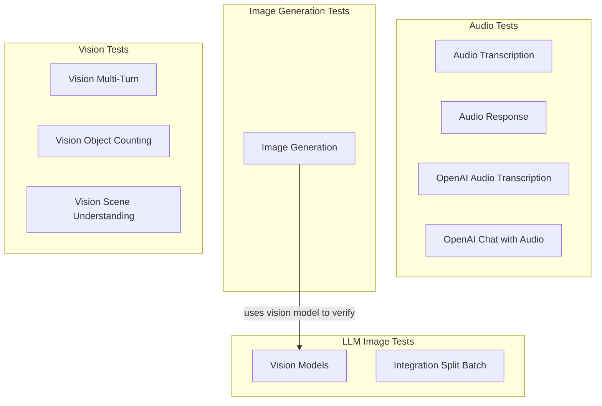

# multimodal_and_tooling_tests
This module contains integration tests for multimodal capabilities, including audio transcription, audio response, image generation, and vision models.

<!-- DIAGRAM_JSON
{
  "nodes": [
    {"id": "AudioTranscription", "label": "Audio Transcription"},
    {"id": "AudioResponse", "label": "Audio Response"},
    {"id": "OpenAIAudioTranscription", "label": "OpenAI Audio Transcription"},
    {"id": "OpenAIChatWithAudio", "label": "OpenAI Chat with Audio"},
    {"id": "ImageGeneration", "label": "Image Generation"},
    {"id": "VisionModels", "label": "Vision Models"},
    {"id": "IntegrationSplitBatch", "label": "Integration Split Batch"},
    {"id": "VisionMultiTurn", "label": "Vision Multi-Turn"},
    {"id": "VisionObjectCounting", "label": "Vision Object Counting"},
    {"id": "VisionSceneUnderstanding", "label": "Vision Scene Understanding"}
  ],
  "edges": [
    {"source": "ImageGeneration", "target": "VisionModels", "label": "uses vision model to verify"}
  ],
  "groups": [
    {"id": "AudioTests", "label": "Audio Tests", "nodes": ["AudioTranscription", "AudioResponse", "OpenAIAudioTranscription", "OpenAIChatWithAudio"]},
    {"id": "ImageGenTests", "label": "Image Generation Tests", "nodes": ["ImageGeneration"]},
    {"id": "LLMImageTests", "label": "LLM Image Tests", "nodes": ["VisionModels", "IntegrationSplitBatch"]},
    {"id": "VisionTests", "label": "Vision Tests", "nodes": ["VisionMultiTurn", "VisionObjectCounting", "VisionSceneUnderstanding"]}
  ]
}
-->
