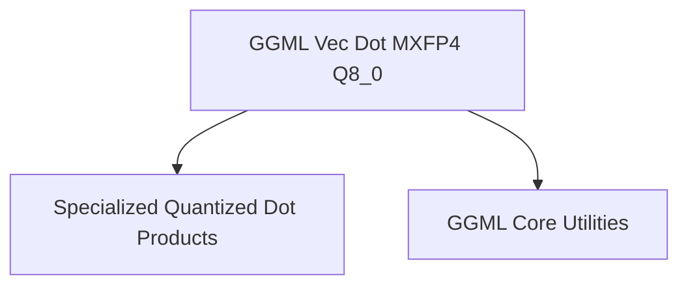

# mxfp4_dot_products Module Documentation

## Introduction

The `mxfp4_dot_products` module provides highly optimized low-level vector dot product implementations specifically for operations involving MXFP4 (mixed-precision floating-point 4-bit) quantized data and Q8_0 (8-bit quantized integer) data. This module is a specialized component within the GGML CPU backend for x86 architectures, designed to accelerate critical computations in quantized neural networks.

## Purpose and Core Functionality

The primary purpose of this module is to efficiently compute the dot product between vectors where one vector is represented in MXFP4 format and the other in Q8_0 format. This operation is fundamental in various machine learning models, especially those employing quantization techniques to reduce memory footprint and improve inference speed.

The core functionality is encapsulated in the `ggml_vec_dot_mxfp4_q8_0` function, which leverages x86 specific intrinsics such as AVX2 and AVX to maximize performance. It processes blocks of quantized data, performing element-wise multiplications and summing the results, incorporating appropriate scaling factors for the quantized types.

## Architecture

The `mxfp4_dot_products` module is a leaf module within the `ggml_cpu_x86_quants` hierarchy, residing under `x86_vec_dot_0_quants` and `specialized_quantized_dot_products`. Its architecture is focused on a single, highly optimized function that takes advantage of specific CPU instruction sets for vector operations.

The `ggml_vec_dot_mxfp4_q8_0` function directly operates on `block_mxfp4` and `block_q8_0` data structures, which define the format for the quantized vectors. It utilizes a lookup table (`kvalues_mxfp4`) and applies scaling based on block-specific exponents and deltas.

<!-- DIAGRAM_JSON
{
    "direction": "TD",
    "nodes": [
        {"id": "ggml_vec_dot_mxfp4_q8_0", "label": "GGML Vec Dot MXFP4 Q8_0", "type": "component", "link": null},
        {"id": "specialized_quantized_dot_products", "label": "Specialized Quantized Dot Products", "type": "external", "link": "specialized_quantized_dot_products.md"},
        {"id": "ggml_core", "label": "GGML Core Utilities", "type": "external", "link": "ggml_core.md"}
    ],
    "edges": [
        {"source": "ggml_vec_dot_mxfp4_q8_0", "target": "specialized_quantized_dot_products"},
        {"source": "ggml_vec_dot_mxfp4_q8_0", "target": "ggml_core"}
    ],
    "groups": []
}
-->

## Integration with Overall System

This module is an integral part of the GGML library's CPU backend, specifically for x86 architectures handling quantized models. It provides the concrete implementation for mixed FP4 and 8-bit quantized dot products. Higher-level operations within the GGML framework that require this specific dot product computation will call `ggml_vec_dot_mxfp4_q8_0`.

It contributes to the overall efficiency of running quantized models on CPUs by offering highly optimized, architecture-specific routines, thereby enabling faster inference and reducing computational overhead within the `ggml_cpu_x86_quants` module and the broader GGML ecosystem. Its dependencies on `ggml_core` highlight its reliance on fundamental GGML types and utility macros.