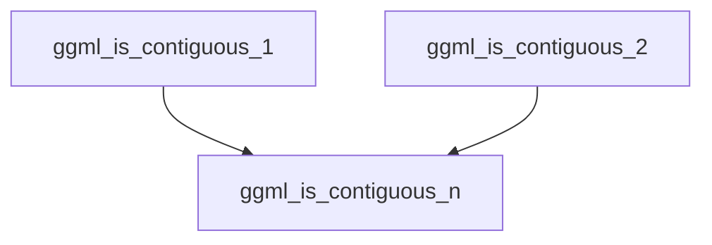

# n_dimensional_contiguity Module Documentation

## Introduction

The `n_dimensional_contiguity` module provides specialized functions for checking the contiguity of `ggml_tensor` objects along specific dimensions. These functions are crucial for optimizing memory access patterns and ensuring correct data manipulation within the GGML framework, particularly when dealing with tensor operations that rely on contiguous memory blocks.

## Core Functionality

This module offers utility functions that act as wrappers to the more general `ggml_is_contiguous_n` function, simplifying contiguity checks for common scenarios:

*   **`ggml_is_contiguous_1`**: Checks if a given `ggml_tensor` is contiguous along its first dimension. This is often relevant for vector-like operations or when the first dimension represents a fundamental access unit.
*   **`ggml_is_contiguous_2`**: Checks if a given `ggml_tensor` is contiguous along its first two dimensions. This is essential for matrix-like operations where data locality across rows and columns is important.

Both functions internally call `ggml_is_contiguous_n` from the `ggml_core` module, providing the tensor and the specific number of dimensions (1 or 2) to check for contiguity.

## Architecture and Component Relationships

The `n_dimensional_contiguity` module is a lightweight set of functions that abstract direct calls to the core `ggml_is_contiguous_n` function. It forms a part of the `ggml_tensor_properties` sub-module within the broader `ggml_core` framework, specifically focusing on dimension-specific contiguity checks.

<!-- DIAGRAM_JSON
{
    "direction": "TD",
    "nodes": [
        {"id": "ggml_is_contiguous_1", "label": "ggml_is_contiguous_1", "type": "component", "link": null},
        {"id": "ggml_is_contiguous_2", "label": "ggml_is_contiguous_2", "type": "component", "link": null},
        {"id": "ggml_is_contiguous_n", "label": "ggml_is_contiguous_n", "type": "external", "link": "ggml_core.md"}
    ],
    "edges": [
        {"source": "ggml_is_contiguous_1", "target": "ggml_is_contiguous_n"},
        {"source": "ggml_is_contiguous_2", "target": "ggml_is_contiguous_n"}
    ],
    "groups": []
}
-->

## How the Module Fits into the Overall System

This module is an integral part of the `ggml_core` library, specifically nested under `ggml_core` -> `ggml_tensor_properties` -> `tensor_contiguity_checks` -> `contiguity_checks` -> `dimension_specific_checks`. It provides fundamental checks that are utilized throughout the GGML library whenever memory layout and contiguity are critical for performance and correctness in tensor operations. Other modules requiring specific N-dimensional contiguity checks would depend on these functions from `n_dimensional_contiguity`.
