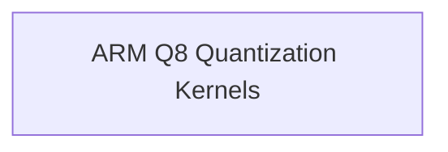

# Neon Q8 Quantization Module

## Introduction
The `neon_q8_quantization` module provides highly optimized functions for quantizing floating-point data rows into 8-bit integer formats (Q8_0 and Q8_1) specifically designed for ARM NEON architectures. This module is critical for enabling efficient inference on ARM-based systems by reducing memory footprint and accelerating computational operations.

## Architecture Overview
This module is a specialized component within the broader `ggml_cpu_arm_quants` module, focusing on ARM NEON optimized quantization routines. It directly interacts with the `arm_row_quantization` sub-module, providing the core implementation for Q8 quantization.

<!-- DIAGRAM_JSON
{
    "direction": "TD",
    "nodes": [
        {"id": "arm_q8_quantization_kernels", "label": "ARM Q8 Quantization Kernels", "type": "module", "link": "arm_q8_quantization_kernels.md"}
    ],
    "edges": [],
    "groups": []
}
-->

## Sub-modules

### [ARM Q8 Quantization Kernels](arm_q8_quantization_kernels.md)
This sub-module contains the core functions `quantize_row_q8_0` and `quantize_row_q8_1` that implement the actual quantization logic for Q8_0 and Q8_1 formats, leveraging ARM NEON intrinsics for performance. It handles the scaling and conversion of float values to 8-bit integers, essential for efficient model deployment on ARM CPUs.