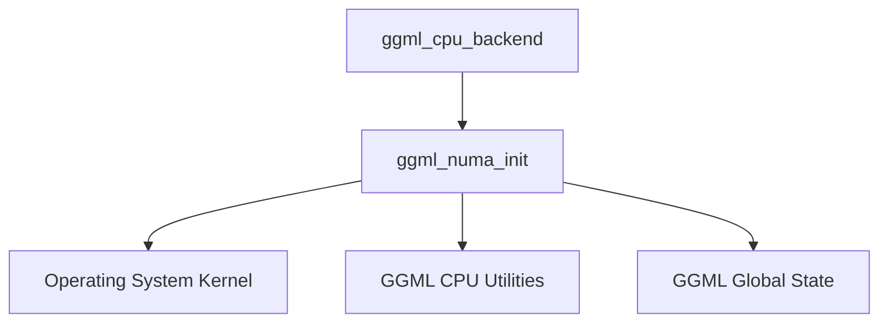

# NUMA Management Module

## Introduction

The `numa_management` module is responsible for initializing and managing Non-Uniform Memory Access (NUMA) settings within the GGML CPU backend. It detects available NUMA nodes and CPUs, determines the current process's NUMA affinity, and assigns CPUs to their respective nodes. Proper NUMA initialization is critical for optimizing performance on multi-core systems with NUMA architectures by ensuring that memory is allocated and accessed efficiently.

## Architecture and Core Components

The `numa_management` module primarily consists of the `ggml_numa_init` function, which orchestrates the NUMA setup process. It interacts closely with the underlying operating system to gather system information regarding NUMA topology.

### Core Component: `ggml_numa_init`

- **File:** `ml/backend/ggml/ggml/src/ggml-cpu/ggml-cpu.c`
- **Description:** This function performs the core NUMA initialization. It first checks if NUMA has already been initialized to prevent redundant operations. It then proceeds to:
    1.  Set the NUMA strategy based on the provided `numa_flag`.
    2.  Obtain the current CPU's NUMA affinity using `ggml_get_numa_affinity`.
    3.  Enumerate all available NUMA nodes by inspecting the `/sys/devices/system/node/` filesystem entries.
    4.  Enumerate all available CPUs by inspecting the `/sys/devices/system/cpu/` filesystem entries.
    5.  Determine the NUMA node and CPU where the current process is executing.
    6.  Iterate through each detected NUMA node and identify which CPUs belong to that node by checking `/sys/devices/system/node/nodeX/cpuY` paths.
    7.  Issue a warning if `/proc/sys/kernel/numa_balancing` is enabled, as this has been observed to degrade performance in GGML contexts.

### Relationships to Other Modules

The `numa_management` module is a sub-module of `cpu_graph_and_data_access`, which in turn is part of the broader [ggml_cpu_backend](ggml_cpu_backend.md) module. It depends on system-level information provided by the Operating System Kernel and potentially utility functions from the [ggml_core](ggml_core.md) module or other parts of [ggml_cpu_backend](ggml_cpu_backend.md) for global state management and NUMA-related checks.

<!-- DIAGRAM_JSON
{
    "direction": "TD",
    "nodes": [
        {"id": "ggml_numa_init", "label": "ggml_numa_init", "type": "component", "link": null},
        {"id": "ggml_cpu_backend", "label": "ggml_cpu_backend", "type": "external", "link": "ggml_cpu_backend.md"},
        {"id": "os_kernel", "label": "Operating System Kernel", "type": "external", "link": null},
        {"id": "ggml_utils", "label": "GGML CPU Utilities", "type": "external", "link": "ggml_cpu_backend.md"},
        {"id": "ggml_global_state", "label": "GGML Global State", "type": "external", "link": "ggml_core.md"}
    ],
    "edges": [
        {"source": "ggml_numa_init", "target": "os_kernel"},
        {"source": "ggml_numa_init", "target": "ggml_utils"},
        {"source": "ggml_numa_init", "target": "ggml_global_state"},
        {"source": "ggml_cpu_backend", "target": "ggml_numa_init"}

    ],
    "groups": []
}
-->

