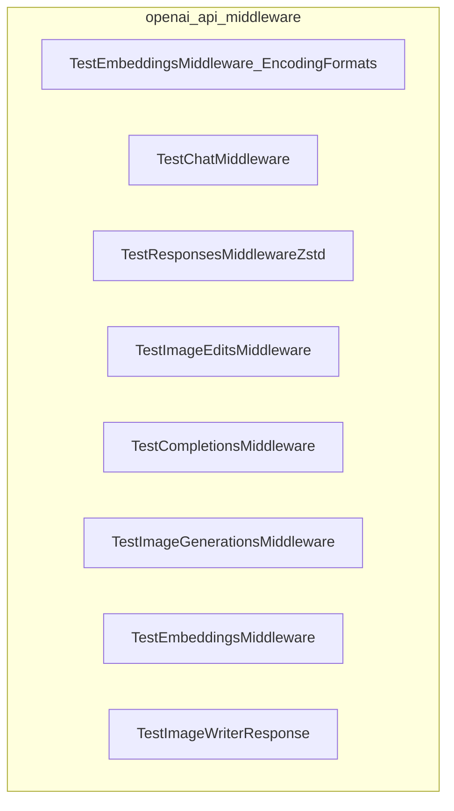

# openai_api_middleware
This module provides a suite of tests for various OpenAI API middleware functionalities, including chat, embeddings, image generation, and response handling.

<!-- DIAGRAM_JSON
{
  "nodes": [
    {"id": "TEMEF", "label": "TestEmbeddingsMiddleware_EncodingFormats"},
    {"id": "TCM", "label": "TestChatMiddleware"},
    {"id": "TRMZ", "label": "TestResponsesMiddlewareZstd"},
    {"id": "TIEM", "label": "TestImageEditsMiddleware"},
    {"id": "TCoM", "label": "TestCompletionsMiddleware"},
    {"id": "TIGM", "label": "TestImageGenerationsMiddleware"},
    {"id": "TEM", "label": "TestEmbeddingsMiddleware"},
    {"id": "TIWR", "label": "TestImageWriterResponse"}
  ],
  "edges": [],
  "groups": [
    {"id": "openai_api_middleware", "label": "openai_api_middleware", "nodes": ["TEMEF", "TCM", "TRMZ", "TIEM", "TCoM", "TIGM", "TEM", "TIWR"]}
  ]
}
-->
