# openclaw_integration
This module provides the core integration logic for OpenClaw, handling its execution, configuration management, and onboarding process. It includes various test components to ensure robust functionality across different scenarios, including legacy path support and model configuration.

<!-- DIAGRAM_JSON
{
  "nodes": [
    {"id": "ORun", "label": "cmd.launch.openclaw.Openclaw.Run"},
    {"id": "TOE", "label": "cmd.launch.openclaw_test.TestOpenclawEdit"},
    {"id": "TOEMN", "label": "cmd.launch.openclaw_test.TestOpenclawEditModelNames"},
    {"id": "TOEAP", "label": "cmd.launch.openclaw_test.TestOpenclawEditAgentsPreservation"},
    {"id": "TIO", "label": "cmd.launch.openclaw_test.TestIntegrationOnboarded"},
    {"id": "TORPA", "label": "cmd.launch.openclaw_test.TestOpenclawRunPassthroughArgs"},
    {"id": "TOLP", "label": "cmd.launch.openclaw_test.TestOpenclawLegacyPaths"},
    {"id": "TOMEC", "label": "cmd.launch.openclaw_test.TestOpenclawModelsEdgeCases"}
  ],
  "edges": [
    {"from": "TOE", "to": "ORun", "label": "tests config"},
    {"from": "TOEMN", "to": "ORun", "label": "tests config"},
    {"from": "TOEAP", "to": "ORun", "label": "tests config"},
    {"from": "TIO", "to": "ORun", "label": "tests onboarding"},
    {"from": "TORPA", "to": "ORun", "label": "tests run args"},
    {"from": "TOLP", "to": "ORun", "label": "tests legacy config"},
    {"from": "TOMEC", "to": "ORun", "label": "tests config parsing"}
  ],
  "groups": [
    {"id": "Core", "label": "Core Logic", "nodes": ["ORun"]},
    {"id": "ConfigTests", "label": "Configuration Tests", "nodes": ["TOE", "TOEMN", "TOEAP", "TOMEC"]},
    {"id": "RuntimeTests", "label": "Runtime & Onboarding Tests", "nodes": ["TIO", "TORPA"]},
    {"id": "LegacyTests", "label": "Legacy Path Tests", "nodes": ["TOLP"]}
  ]
}
-->

```mermaid
flowchart TD
    subgraph Core Logic
        ORun[cmd.launch.openclaw.Openclaw.Run]
    end

    subgraph Configuration Tests
        TOE[cmd.launch.openclaw_test.TestOpenclawEdit]
        TOEMN[cmd.launch.openclaw_test.TestOpenclawEditModelNames]
        TOEAP[cmd.launch.openclaw_test.TestOpenclawEditAgentsPreservation]
        TOMEC[cmd.launch.openclaw_test.TestOpenclawModelsEdgeCases]
    end

    subgraph Runtime & Onboarding Tests
        TIO[cmd.launch.openclaw_test.TestIntegrationOnboarded]
        TORPA[cmd.launch.openclaw_test.TestOpenclawRunPassthroughArgs]
    end

    subgraph Legacy Path Tests
        TOLP[cmd.launch.openclaw_test.TestOpenclawLegacyPaths]
    end

    TOE --> ORun
    TOEMN --> ORun
    TOEAP --> ORun
    TIO --> ORun
    TORPA --> ORun
    TOLP --> ORun
    TOMEC --> ORun
```
