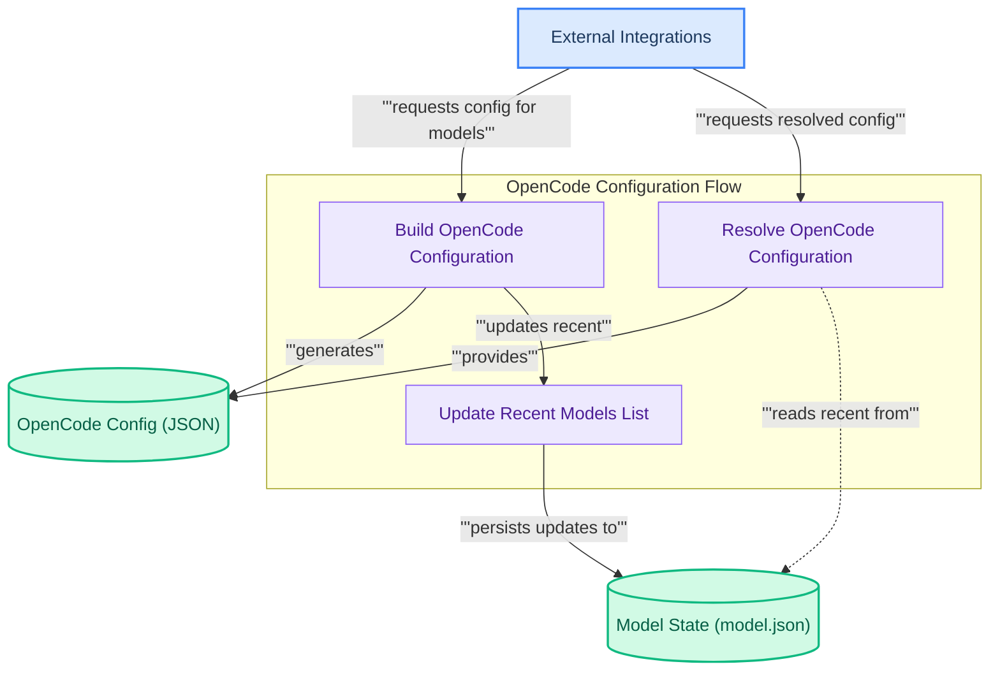

# OpenCode Integration
This module handles the dynamic generation and resolution of OpenCode's model configuration, ensuring new models are correctly integrated and managing a persistent list of recently used models for quick access within the OpenCode environment.

<!-- DIAGRAM_JSON
{
    "direction": "TD",
    "nodes": [
        {
            "id": "build_config",
            "label": "Build OpenCode Configuration",
            "type": "component",
            "link": null
        },
        {
            "id": "resolve_config",
            "label": "Resolve OpenCode Configuration",
            "type": "component",
            "link": null
        },
        {
            "id": "update_recent",
            "label": "Update Recent Models List",
            "type": "component",
            "link": null
        },
        {
            "id": "opencode_json",
            "label": "OpenCode Config (JSON)",
            "type": "data",
            "link": null
        },
        {
            "id": "model_json_state",
            "label": "Model State (model.json)",
            "type": "data",
            "link": null
        },
        {
            "id": "external_integrations",
            "label": "External Integrations",
            "type": "external",
            "link": "external_integrations.md"
        }
    ],
    "edges": [
        {
            "source": "external_integrations",
            "target": "build_config",
            "label": "requests config for models"
        },
        {
            "source": "external_integrations",
            "target": "resolve_config",
            "label": "requests resolved config"
        },
        {
            "source": "build_config",
            "target": "opencode_json",
            "label": "generates"
        },
        {
            "source": "build_config",
            "target": "update_recent",
            "label": "updates recent"
        },
        {
            "source": "resolve_config",
            "target": "opencode_json",
            "label": "provides"
        },
        {
            "source": "resolve_config",
            "target": "model_json_state",
            "label": "reads recent from"
        },
        {
            "source": "update_recent",
            "target": "model_json_state",
            "label": "persists updates to"
        }
    ],
    "groups": [
        {
            "id": "config_flow",
            "label": "OpenCode Configuration Flow",
            "role": "analytical",
            "nodes": [
                "build_config",
                "resolve_config",
                "update_recent"
            ]
        }
    ]
}
-->

