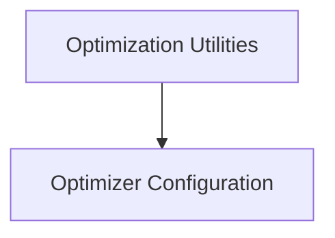

# Optimizer Configuration Module

## Introduction
The `optimizer_configuration` module is a crucial part of the `llama_cpp_common` library, specifically within the `optimization_utilities` sub-module. Its primary role is to manage and provide configuration parameters for various optimization algorithms utilized by the `ggml` library. This module enables the dynamic selection and parameterization of optimizers, facilitating the training and fine-tuning of machine learning models.

## Architecture Overview
The `optimizer_configuration` module is a leaf module within the `optimization_utilities` hierarchy. It directly interacts with the `ggml` optimization routines by providing the necessary parameters and optimizer types.

<!-- DIAGRAM_JSON
{
    "direction": "TD",
    "nodes": [
        {"id": "optimization_utilities", "label": "Optimization Utilities", "type": "module", "link": "optimization_utilities.md"},
        {"id": "optimizer_configuration", "label": "Optimizer Configuration", "type": "module", "link": "optimizer_configuration.md"}
    ],
    "edges": [
        {"source": "optimization_utilities", "target": "optimizer_configuration"}
    ],
    "groups": []
}
-->

## Core Functionality

### `common_opt_lr_pars`
This component is responsible for generating `ggml_opt_optimizer_params` structures, which encapsulate the configuration settings for various optimizers. It takes a `userdata` pointer, which is cast to an `lr_opt` object, to extract learning rate (`alpha`) and weight decay (`wd`) values. These parameters are then applied to both AdamW and SGD optimizer configurations, ensuring consistent settings across different optimization algorithms.

### `common_opt_get_optimizer`
The `common_opt_get_optimizer` component provides a mechanism to select the appropriate `ggml_opt_optimizer_type` based on a string input. It performs a case-insensitive comparison against known optimizer names like "adamw" and "sgd". This allows for flexible and dynamic selection of the optimizer type at runtime, which is essential for configuring optimization processes based on user input or system requirements. If an unknown optimizer name is provided, it returns `GGML_OPT_OPTIMIZER_TYPE_COUNT`.
