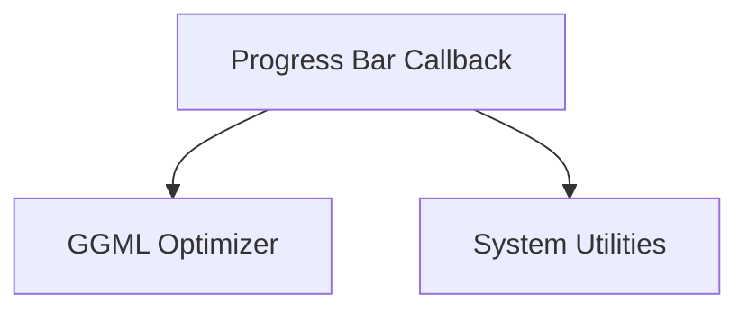

# Optimizer Utilities Module Documentation

## Introduction

The `optimizer_utilities` module, a sub-module of `ggml_optimizer`, provides essential utility functions to support the optimization process within the `llama.cpp` project. Its primary role is to offer feedback and progress tracking during training and validation epochs, enhancing the user's ability to monitor the optimization's real-time status and performance.

## Core Functionality

This module primarily focuses on utility functions for the optimization process. The key component is:

*   `ggml_opt_epoch_callback_progress_bar`: This function is responsible for rendering a dynamic progress bar to the standard error stream (`stderr`). It displays crucial information during each optimization batch, including:
    *   Current training/validation epoch status.
    *   A visual progress bar indicating completion.
    *   Data processed counts (`idata`/`idata_max`).
    *   Real-time loss and its uncertainty.
    *   Accuracy and its uncertainty (if applicable).
    *   Elapsed time for the current batch.
    *   Estimated time of arrival (ETA) for the epoch.

    This callback function integrates directly into the `ggml` optimization loop, providing immediate visual feedback to the user on the model's learning progress.

## Architecture and Component Relationships

The `optimizer_utilities` module is designed to be a supporting component for the main `ggml_optimizer`. It consumes data and context provided by the optimizer to generate informative output. It has a child module, `optimizer_configuration`, which likely handles settings related to the optimizer.

<!-- DIAGRAM_JSON
{
    "direction": "TD",
    "nodes": [
        {"id": "progress_bar_callback", "label": "Progress Bar Callback", "type": "component", "link": null},
        {"id": "ggml_optimizer", "label": "GGML Optimizer", "type": "external", "link": "ggml_optimizer.md"},
        {"id": "system_utilities", "label": "System Utilities", "type": "external", "link": "system_utilities.md"}
    ],
    "edges": [
        {"source": "progress_bar_callback", "target": "ggml_optimizer"},
        {"source": "progress_bar_callback", "target": "system_utilities"}
    ],
    "groups": []
}
-->

### Relationships:

*   **`progress_bar_callback`** is the main internal component, providing the progress bar functionality.
*   It depends on the **`ggml_optimizer`** module for optimization context (`ggml_opt_context_t`), dataset information (`ggml_opt_dataset_t`), and optimization results (`ggml_opt_result_t`) to display relevant metrics like loss and accuracy. The parent module, `ggml_optimizer`, orchestrates the overall optimization process.
*   It utilizes functions from **`system_utilities`** (part of [llama_cpp_common](llama_cpp_common.md)) for time-related operations, such as `ggml_time_us` to calculate elapsed time and estimated time of arrival (ETA).
*   The module has a child module, [optimizer_configuration](optimizer_configuration.md), which handles specific optimizer settings. While not directly interacting with the progress bar, it's an important part of the overall optimizer ecosystem.

## How it Fits into the Overall System

The `optimizer_utilities` module plays a crucial support role within the broader `llama.cpp` project. By providing clear and real-time feedback during model optimization, it significantly improves the developer and user experience. It acts as the visual interface for the optimization engine, allowing for easy monitoring of training progress and performance metrics. This integration ensures that the complex processes of model optimization are transparent and understandable, facilitating debugging and performance tuning. It is an integral part of the [ggml_optimizer](ggml_optimizer.md) ecosystem, which itself is part of the lower-level `ggml` backend within `llama_cpp_common`.