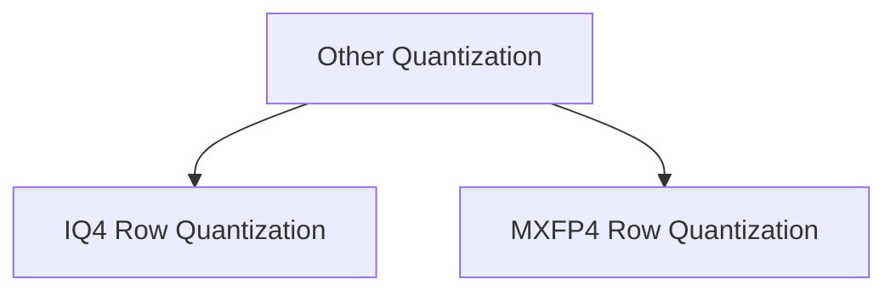

# Other Quantization Module (other_quantization)

## Introduction

The `other_quantization` module, a sub-component of `ggml_cpu_quants_generic`, provides specialized row quantization functions for various formats beyond standard quantization methods. These functions are crucial for optimizing model inference by reducing memory footprint and improving computational efficiency on CPU architectures. This module focuses on unique quantization schemes such as IQ4_NL, IQ4_XS, and MXFP4.

## Architecture

The `other_quantization` module is structured into specialized sub-modules, each handling a particular quantization format or related operations. The current architecture facilitates the integration of diverse quantization techniques.

<!-- DIAGRAM_JSON
{
    "direction": "TD",
    "nodes": [
        {"id": "iq4_row_quantization", "label": "IQ4 Row Quantization", "type": "module", "link": "iq4_row_quantization.md"},
        {"id": "mxfp4_row_quantization", "label": "MXFP4 Row Quantization", "type": "module", "link": "mxfp4_row_quantization.md"}
    ],
    "edges": [
        {"source": "other_quantization", "target": "iq4_row_quantization"},
        {"source": "other_quantization", "target": "mxfp4_row_quantization"}
    ],
    "groups": []
}
-->

## Sub-modules

This module is composed of the following sub-modules, each contributing to specialized quantization capabilities:

### [IQ4 Row Quantization](iq4_row_quantization.md)

This sub-module focuses on row quantization techniques utilizing the IQ4_NL and IQ4_XS formats. It provides functions that efficiently convert floating-point data to these specific quantized representations, which are vital for reducing model size and speeding up inference.

### [MXFP4 Row Quantization](mxfp4_row_quantization.md)

Dedicated to the MXFP4 quantization format, this sub-module offers specific implementations for quantizing rows. Its functions enable optimized processing for models that leverage the MXFP4 format, leading to improved performance characteristics on supported hardware.
